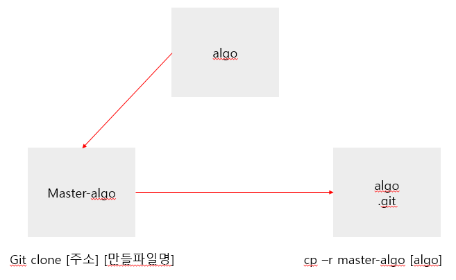
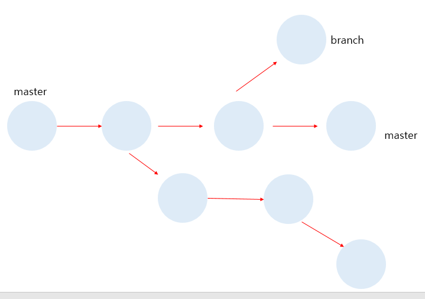
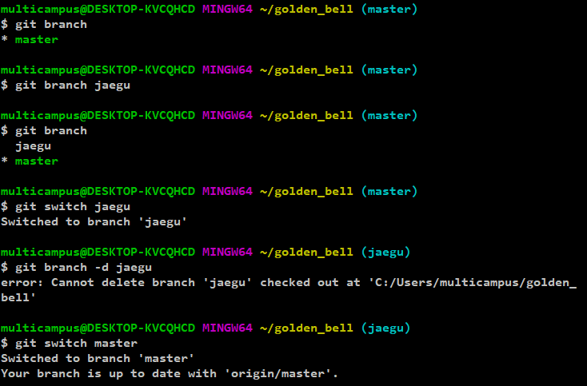
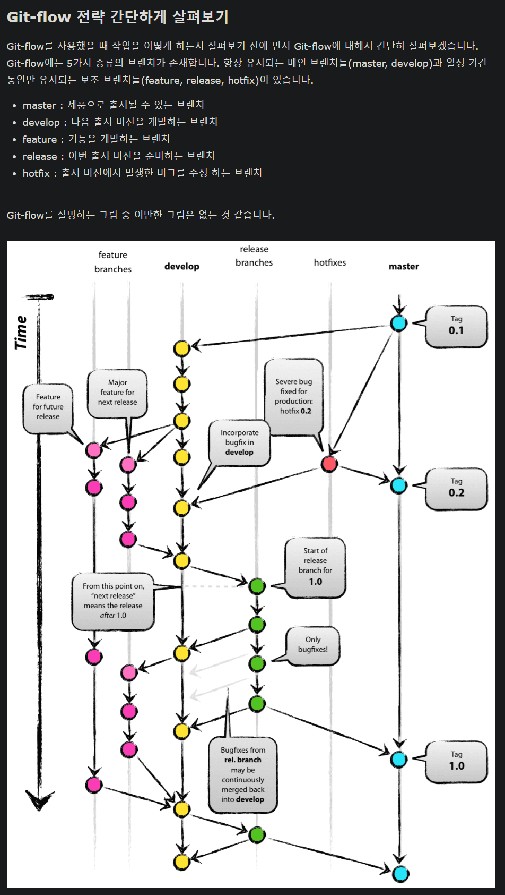

# Github TIL

## 1. TIL ?

> - TIL은 **T**oday **I** **L**earned 의 줄임말로 개발자 사이에서 매일 자신이 학습한 내용을 commit(기록)하는 것
> - github, bitbucket, gitlab과 같은 원격 저장소에서 제공하는 1commit - 1grass 의 흥미 요소 제공


## 2. TIL 세팅

### (1) Git으로 프로젝트 관리 시작 : `git init`

- 자신이 앞으로 학습한 내용을 기록한 `TIL` 폴더를 하나 생성한다. 이때 해당 폴더는 최상단에 생성한다.
- `git bash` 에서 `TIL` 폴더로 이동한 이후에 아래의 명령어로 `git` 관리를 시작한다

```shell
$ git init
```


### (2) Commit을 위한 Staging : `git add`

- 현재 코드 상태의 스냅샷을 찍기 위한 파일 선택 (== Staging Area에 파일 추가)

```shell
$ git add [파일 이름] # .은 모든 변경 사항을 staging area로 올림
```


### (3) 버전 관리를 위한 스냅샷 저장 : `git commit`

- 현재 상태에 대한 스냅샷을 `commit` 하여, 버전 관리를 진행한다.

```shell
$ git commit -m "커밋 메시지"
```


### (4) 원격 저장소 정보 추가 : `git remote` 

- Github 원격(remote) 저장소(repository)를 생성하고 `TIL` 폴더와 연결한다.
- 새로운 원격 저장소가 추가될 때만 입력한다.

```shell
$ git remote add origin [github 원격 저장소 주소]
```


### (5) 원격 저장소로 코드 `git push` 

- 최종적으로 Github 원격 저장소에 Push 한다.

```shell
$ git push origin master
```


### (6) 그 외 명령어

- 현재 `git` 의 상태를 조회 `git status` 

```shell
$ git status
```

- 버전 관리 이력을 조회

```shell
$ git log
```

- `git` 설정(user.name & user.email) : **최초 1회 설정**

```shell
$ git config --global user.name "Jaegu Kang"
$ git config --global user.email "kjaegu9771@naer.com"
```


## 3. README.md

> 원격(remote) 저장소(repository) 에 대한 정보를 기록하는 마크다운 문서. 일반적으로 해당 프로젝트를 사용하기 위한 방법 등을 기재한다.


### (1) `README.md` 파일 생성

- `README.md` 파일을 `TIL` 폴더(최상단)에 생성한다. 이름은 반드시 **README.md** 로 설정한다.

```shell
$ touch README.md
```


### (2) (자신만의) TIL 원칙에 대한 간단한 내용 추가

- 마크다운 작성법 pdf에서 배우고 실습한 내용을 토대로 `README.md` 파일을 작성한다
- 형식은 자유롭게 작성하되 마크다운 문법(의미론적)을 지켜서 작성한다.


### (3) 저장 후 버전관리 : `add`, `commit`, `push` 

- 작성이 완료되면 아래의 명령어를 통해 commit 이력을 남기고 원격 저장소로 push 한다.

```shell
$ git add README.md
$ git commit -m "add README.md"
$ git push origin master
```


## 4. 추가 학습 내용 관리

### (1) 추가 내용 관리

- `TIL` 폴더 내에서 학습을 원하는 내용의 폴더를 생성하고 파일들을 생성한 후 작업을 진행한다.

```shell
$ mkdir python
```


### (2) 변경 사항을 저장하고, 원격저장소로 옮긴다.

- 업데이트가 완료되면 아래의 명령어를 통해 commit 이력을 남기고 원격 저장소로 push 한다.

```shell
$ git add .
$ git commit -m "학습 내용 추가"
$ git push origin master
```


### (3) Git bash 한글 깨짐 문제 수정

___

```shell
$ git config --global core.quotepath false
```


### (4) git clone

___

```shell
$ git clone [복사한 주소]
```





### (5) Github A-Z 모든내용
___

```shell
https://parksb.github.io/article/28.html
```


### (6) Github 공동 작업 방법

___

john		A

재구		B

john		C

재구		D

1. 다른 폴더 건드리지 않는다.
2. 나는 작업을 `master` 에서 진행하지 않는다. (Master x)
3. 본인만의 `branch` 을 만들고 거기에서만 코드 작업을 한다.
4. 그것들을 한곳에 모아서 `Merge request` 깃랩에서.. 깃허브에서는 `pull request` 
5. `merge` 한다.




1.  ```shell
   $ git init
   ```

   => master 가 생성됨

   

2. ```shell
   $ git branch
   ```

   => 현재 브랜치 목록 나옴

   

3. ```shell
   $ git branch [브랜치이름]
   ```

   => 브랜치 만듬

   

4. ```shell
   $ git switch [브랜치이름]
   $ git checkout [브랜치이름]
   ```

   => 해당브랜치 로 이동한다. ( 여기서 작업한다 이제부터 ) 마스터에서 커밋 ㄴㄴ

   

5. ```shell
   $ git branch -d [브랜치이름]
   ```

   => branch 지우기




> 브랜치(jaegu)에서 작업하고... master 에다가 합친다.... 
>
> 이 과정을 `merging` 이라고 한다.
>
> **merging 전에 무조건 `master` 로 이동한 후에 합쳐야 한다.**

```shell
$ git merge [병합할 브랜치의 이름] (master)
```

### Branch => 1회용


- Branch 를 만들면서 이동

```shell
$ git switch -c [브랜치이름]
$ git checkout -b [브랜치이름]
```

=> 브랜치를 만들면서 이동하는 것. ( 만들고 스위치 기능 동시에 함 )


- 로그 상태 확인하기

```shell
$ git log --oneline
```


- Vim 명령어..

```
:wq   저장하고 빠져나간다.
```


- Merge 하기전에 push 한다. ( 깃랩에 merge request 보낸다.... )

```shell
$ git push origin jaegu (jaegu)
```


## Git merge 종류

- **FF - Merge** ( fast forward )   =>   HEAD
  - 혼자 작업할때 자주 쓰이게 될 것

- **Auto - Merge** 
  - 개별 브랜치의 작업들이 충돌하지 않을때, ( git ) 이 자동으로 해줌.
  - commit 을 새롭게 하나 쌓는다...
  - 
- **Conflict Merge**
  - 가장 안좋은 상황
  - 동일한 파일을 건드렸을 때.
  - 두 개 합쳤을때 두가지 진실이 있을때는 우리에게 선택하라고 한다...
  - `git commit -m "Resolve conflicts"` 를 남겨주는 편


## Git Flow ( git 순서 )




- ```shell
  $ git log --oneline --graph
  ```

  => 그래프 상태보기


#### - Commit 커밋 날짜 변경

```shell
git commit --amend --no-edit --date "Mon 20 Feb 2020 19:17:19 KST"
```

- 마지막 커밋날짜를 임의의 날짜로 변경


```shell
GIT_COMMITTER_DATE="Wed Feb 16 14:00 2011 +0100" git commit --amend	
```

- 변경된 시간으로 새로운 커밋을 작성하는것


## 공동 작업 순서

1. `merge` 된 `master` 를 `pull` 이후에는 본인 `branch` 삭제 후, 재생성
2. 본인의 `branch` 에서 코드 작업 할 것 ( jaegu 에서 commit 하기 )
3. `master` 에 `Commit` 하지말 것
4. 항상 작업 시작전에 본인의 `branch` 확인하기 (jaegu)
5. 위의 작업들 반복