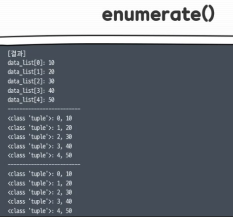
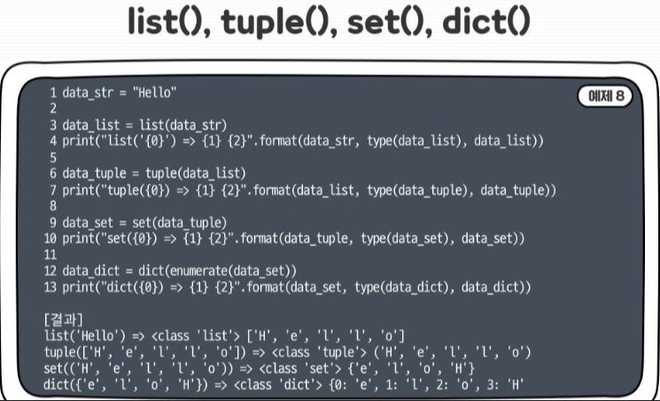

# 0115

# 내장함수

1. 수치 연산 함수
   - abs( k )
     - k의 절대값 리턴
   -  divmod(a, b)
     - a를 b로 나눴을 때의 **몫과 나머지를 튜플 객체로 반환**하는 함수
   - pow(a, b)
     - a로 전달된 인자 값에 대해 b의 인자 값으로 **제곱한 결과를 반환**하는 함수


2. 시퀀스형/반복 가능한 자료형을 다루는 함수

   - all() -- ~~이거 and 아닌가..?~~

     - 반복 가능한 자료형인 List, Tuple, Set, dictionary, 문자열 등을 인자로 전달하여
       **항목 모두가 True로 평가되면 True를 반환**하고, 
       **False로 평가되는 항목이 하나라도 있으면 False를 반환**하는 함수
     - 0, "", None 은 False 로 평가된다.

   - any() -- ~~이거 or 아닌가..?~~

     - 반복 가능한 자료형인 List, Tuple, Set, dictionary, 문자열 등을 인자로 전달하여
       **항목 모두가 False로 평가되면 False를 반환**하고,
       **True로 평가되는 항목이 하나라도 있으면 True를 반환**하는 함수

   - enumerate()

     - List, Tuple, 문자열과 같은 시퀀스형을 입력받아
       **인덱스를 포함하는 튜플 객체를 항목으로 구성하는 enumerate 객체를 리턴**하는 함수
       리스트의 몇번째 인덱스의 값이 무엇인지 볼때 사용하면 좋다.

       ```python
       list = [11, 22, 33, 44]
       
       for idx, val in enumerate(list) :
           print("list[{0}] : {1}".format(idx, val))
           
       for obj in enumerate(list) :
           print("{0}: {1}, {2}".format(type(obj), obj[0], obj[1]))
           
       for obj in enumerate(list) :
           print("{0}: {1}, {2}".format(type(obj), *obj))
       ```

       

       
   
       

   - filter()

     - 조건에 해당하는 항목을 걸러내는 함수

   - list(), tuple(), set(), dict()

     - 
     - 
  - 
   
- map()
  
- max(), min()
  
   - range()

     - range(1, 10, 1)
    [1, 2, 3, 4, 5, 6, 7, 8, 9]
   
- sorted() : 오름차순
  
   - reversed() : 내림차순
   
   - zip()


3. 변환함수
   - chr() - 정수 형태의 유니코드를 인자로 받아 해당 코드의 **문자를 반환**
   - ord() - 문자를 인자로 전달받아 **유니코드 값(10진 정수)을 반환**
   - hex() - 10진 정수 값을 인자로 전달받아 **16진수로 변환된 값을 반환**
   - int()
   - float()
   - str()


4. 객체 조사를 위한 함수
   - dir() : 인자로 전달된 객체가 가지고 있는 변수, 메서드와 같은
     			**속성 정보를 리스트 객체로 반환**
           			인자를 전달하지 않고 호출하면
           			현재 **지역 스코프에대한 정보를 리스트 객체로 반환**
   - globals() : 현재의 전역 심볼 테이블을 보여주는
     		             딕셔너리를 반환하는 함수
   - locals() : 현재의 지역 심볼 테이블을 보여주는
                          딕셔너리를 반환하는 함수
   - id() : 인자의 고유 주소값을 반환하는 함수
   - isinstance(a, b) : **a객체가 b클래스의 인스턴스인지에 대한 여부를 True/False 로 반환**
   - issubclass(a, b) : a클래스가 b클래스의 서브클래스인지에 대한 여부를 True/False 로 반환
   


5. 실행 관련 함수
   - eval() : 실행 가능한 표현식의 문자열을 인자로 전달받아
     				해당 문자열의 표현식을 실행한 결과값을 반환하는 함수

