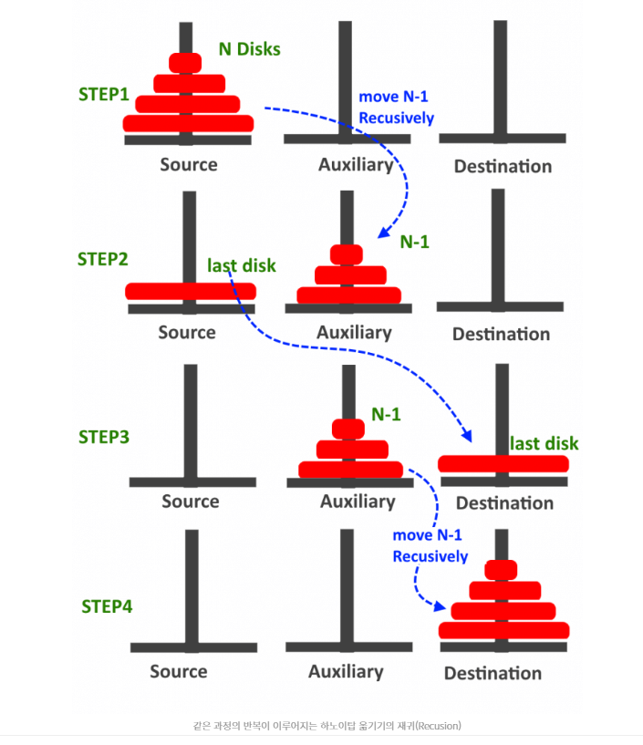

# 파이썬 (6) 자료구조 0129

>


### 문제풀이

___

- 최대공약수 (GCD : greatest common divisor)

>최대공약수는 2개의 숫자간의 공통된 약수 중 가장 큰 수를 말한다.
>
>소인수분해로 구하는 방법도 있지만 매우 불편하기 때문에 `유클리드 호제법` 을 사용한다.
>
>**유클리드 호제법**
>
>192 와 72가 있으면 큰 수를 작은 수로 나누어 나머지를 구한다. 여기서는 192 % 72 를해서 48를 구한다.
>
>이제 48과 72를 비교해서 마찬가지로 나눈다. 72 % 48 해서 나머지 24 가 나온다.
>
>48 % 24 이면 나머지가 0 이므로, 이 24 가 최대 공약수가 된다.

```python
def gcd(a, b):	# GCD - greatest common divisor ( 최대공약수 )
    if b > a :
        tmp = a
        a = b
        b = tmp
    while b > 0 :
        c = b
        b = a & b	# b가 작은 값이 되고
        a = c	# a 가 기존 b 값을 받아서 큰 값이 됨
    return a
```


- 최소공약수 (LCM : lowest common multiple)

```python
def lcm(a, b):
    gcd = gcd(a, b)
	return a*b // gcd
```


#### 아스키 코드표


## 재귀함수

#### DP ( Dynamic Programming ) : 동적 계획법

> Dynamic  => Divede & Conquer.

1. 

2. Optimal substruction


` 재귀적 구현 ` 이 가능한가..?


`함수 내부에서 자기 자신을 호출 하는 함수`

- 예시

```python
def ssafy():
    print('Hello, ssafy!', end=" ")
    ssafy()

ssafy()
```


- 재귀함수 구성

```python
def recur():
	종료조건
	1. base_case ( 첫째항..?  종료조건 )
	2. recursive step (반복할 대상) ( 재귀스텝 )
```

1. 먼저 수학적 기호로 정의하고 문제를 푸는게 좋다.

2. 첫째항에 도달했을때 재귀문이 끝나는..


#### 팩토리얼 계산

- 재귀 사용하지 않고 만드는 코드

```python
def fact(num):
    result = 1    # 곱셈기준은 초기화는 1 로
    
    for n in range(1,num+1):
        result *= n
    
    return result
```


- 재귀 사용하고 만드는 코드

```python
def factorial(num):
    if num == 1:
        return 1
    
    # 리컬시브 스텝
    else:
        return num * factorial(num -1)
```


## 반복문과 재귀함수
```python
factorial(3)
3 * factorail(2)
3 * 2 * factorial(1)
3 * 2 * 1
3 * 2
6
```

* 두 코드 모두 원리는 같다! 


1. 반복문 코드
    - n이 1보다 큰 경우 반복문을 돌며, n은 1씩 감소한다. 
    - 마지막에 n이 1이면 더 이상 반복문을 돌지 않는다.


2. 재귀 함수 코드
    - 재귀 함수를 호출하며, n은 1씩 감소한다. 
    - 마지막에 n이 1이면 더 이상 추가 함수를 호출하지 않는다.


* 재귀함수는 기본적으로 같은 문제이지만 점점 범위가 줄어드는 문제를 풀게 된다.

* 재귀함수를 작성시에는 반드시, `base case`가 존재 하여야 한다. 

* `base case`는 점점 범위가 줄어들어 반복되지 않는 최종적으로 도달하는 곳이다. 

* 재귀를 이용한 팩토리얼 계산에서의 base case는 **n이 1일때, 함수가 아닌 정수 반환하는 것**이다.

[Python Tutor](https://goo.gl/k1hQYz)


___

### 하노이의 탑 알고리즘.. ( 재귀함수 )

[하노이 탑 알고리즘](https://ko.khanacademy.org/computing/computer-science/algorithms/towers-of-hanoi/a/towers-of-hanoi)

___





## 재귀 추가

1. base case
   - 정답을 찾았을 때,
   - 못 찾았을 때
2. recursive step
   - 계속 가야할 때


3. 데이터(누적) : 인자