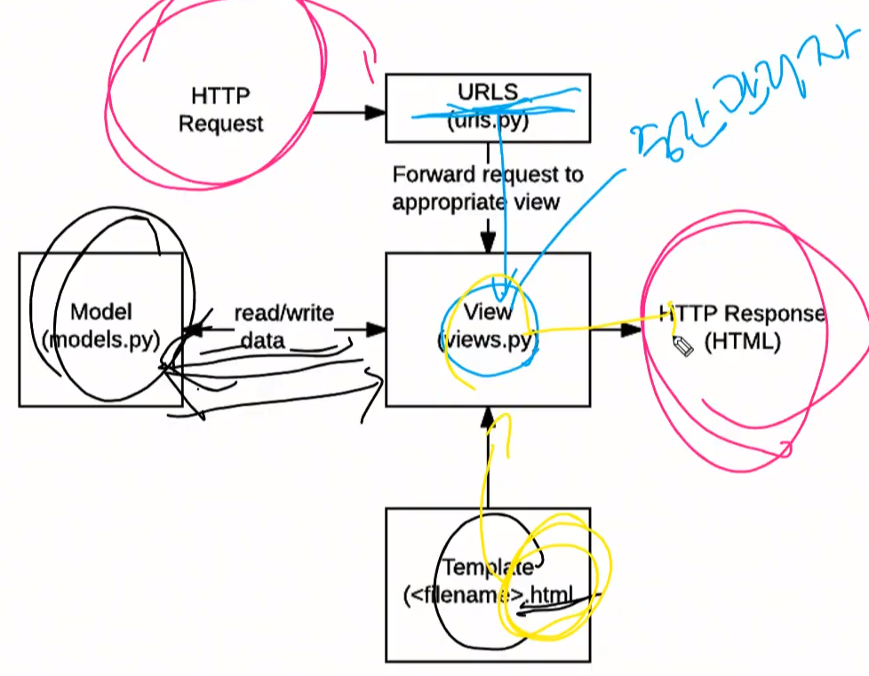

# Django

> 파이썬 기반 웹 프레임워크
>
> ex) 스포티파이, 인스타그램, 드랍박스 , 딜리버리 히어로
>
> 대용량 처리 가능
>
> 검증된 프레임 워크


## 동작 과정

> MVC 패턴


| MVC 패턴   | django   |
| ---------- | -------- |
| Model      | Model    |
| View       | Template |
| Controller | View     |

- Model
  - 데이터 관리 (db)
- View
  - 실제 화면이 보여지는 부분
- Controller
  - 중간 관리 (상호동작)


### 장고는 MTV 모델을 따른다. (MVC 패턴과 유사)

​	

|                         | django   |
| ----------------------- | -------- |
| 데이터 관리             | model    |
| 실제 화면 보여지는 부분 | Template |
| 중간 관리 상호 동작     | View     |


- 동작과정




## 설치 순서

- 패키지 설치
  - `2.1.15 버전 설치`
  - 삭제는 `pip uninstall Django`

```bash
$ pip install django==2.1.15
```


- 프로젝트 생성
  - `project` 이름의 폴더가 생김

```bash
$ django-admin startproject project
```


- 앱 설정

```bash
$ python
```


- 실행
  - 해당 폴더 안에서 이 명령어를 실행시켜야 한다.
  - 서버 종료는 터미널에서 `ctrl + c` 

```bash
~/ $ cd project
~/project $ python manage.py runserver 8080
```


### 설정

___

- setting.py 

  - 28번라인

    - ```python
      ALLOWED_HOSTS = ['*']
      ```

    - 호스트 허락

    

  - 106번 라인

    - ```python
      LANGUAGE_CODE = 'ko-KR'
      ```

    - 언어 설정


