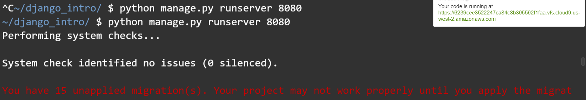

# django

> 파이썬 웹 프레임워크

* MTV 패턴

  

## 설치

```bash
$ pip install django==2.1.15
```

* 수업에서는 `2.1.15` 를 기준으로 진행 예정입니다.


## django 프로젝트 시작

### 프로젝트 생성

```bash
$ django-admin startproject {프로젝트명}
```

### 서버실행

* `django_intro` 폴더의 `settings.py` 파일에 아래와 같이 수정한다.

  ```python
  # 28번째 라인
  ALLOWED_HOSTS = ['*']
  ```

* 반드시 서버 실행시 명령어가 실행되는 디렉토리를 확인할 것.

```bash
~/ $ cd django_intro/
~/django_intro/ $ python manage.py runserver 8080
```

* 실행된 서버는 우측의 영역의 url을 클릭한다.

  

* 서버 종료는 터미널에서 `ctrl + c` 함께 입력한다.

### 리눅스 명령어

* `cd` : change directory

  ```bash
  #  django_intro 폴더로 이동
  ~/ $ cd django_intro/
  ~/django_intro $
  # 상위 디렉토리로 이동
  ~/django_intro $ cd ..
  ~/ $
  # ~/ 로 이동
  home/ $ cd
  ~/ $
  ```

* `ls` : 현재 디렉토리 파일 목록

  ```bash
  ~/django_intro $ ls
  db.sqlite3  django_intro/  manage.py*
  ```

### App 생성

* django는 여러개의 앱을 가진 하나의 프로젝트로 구성된다.
  * 커뮤니티를 만든다.
    * 회원과 관련된 app - `accounts`
    * 게시글과 관련된 app -`posts`

```bash
$ python manage.py startapp {app이름}
```

* app을 생성하고 반드시 `settings.py` 의 `INSTALLED_APPS` 에 등록한다.

  ```python
  INSTALLED_APPS = [
      ...
      'pages',
  ]
  ```


## 기본 흐름

### 1. `urls.py`

```python
# django_intro/urls.py
from pages import views

urlpatterns = [
    path('lotto/', views.lotto),
]
```

* path에 url은 항상 `/` 로 닫아준다.

### 2. `views.py`

```python
# pages/views.py
import random

def lotto(request):
    pick = random.sample(range(1, 46), 6)
    context = {
        'pick': pick
    }
    return render(request, 'lotto.html', context)
```

* 함수를 정의할 때, 항상 첫번째 인자는 `request`로 작성해둔다.
  * 내부적으로 요청을 처리할 때, 함수 호출 시 요청 정보가 담긴 객체를 넣어준다.

* `render` 함수를 통해서 반환한다.
  * 첫번째 인자 : `request`
  * 두번째 인자 : 템플릿 파일(`html`)
  * 세번째 인자 : dictionary, 템플릿에서 활용을 하려고 하는 값들을 전달

### 3. `template` 파일 생성

* 반환할 `html` 파일은 항상 `templates`  폴더 안에 생성한다.

```html
<!-- pages/templates/lotto.html -->
<p>{{ pick }} </p>
```

* context 딕셔너리의 key 값을 적으면 출력된다.

## Variable routing

> url의 특정 위치의 값을 변수로 활용

### 1. urls.py

```python
# django_intro/urls.py
path('hi/<str:name>/', views.hi),
path('add/<int:a>/<int:b>/', views.add),
```

### 2. views.py

```python
# pages/views.py
def hi(request, name):
    context = {
        'name': name
    }
    return render(request, 'hi.html', context)
```

### 3. template

```html
<!-- pages/templates/hi.html-->
<h1>
    안녕, {{name}}
</h1>
```


## DTL

> 템플릿파일(html)은 django template language를 통해 구성할 수 있다.

### 기본문법

1. 출력 `{{ }}`

   ```html
   {{ menu }}
   {{ menu.0 }}
   ```

2. 문법 ``

   ```html
   
   
   
   ```


