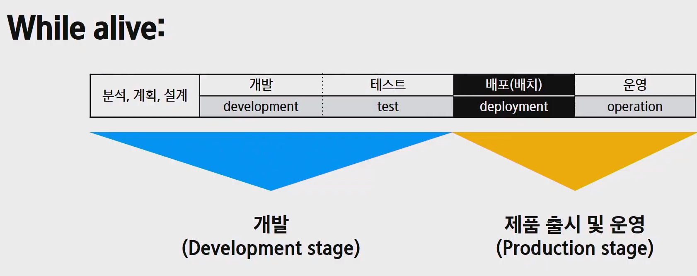
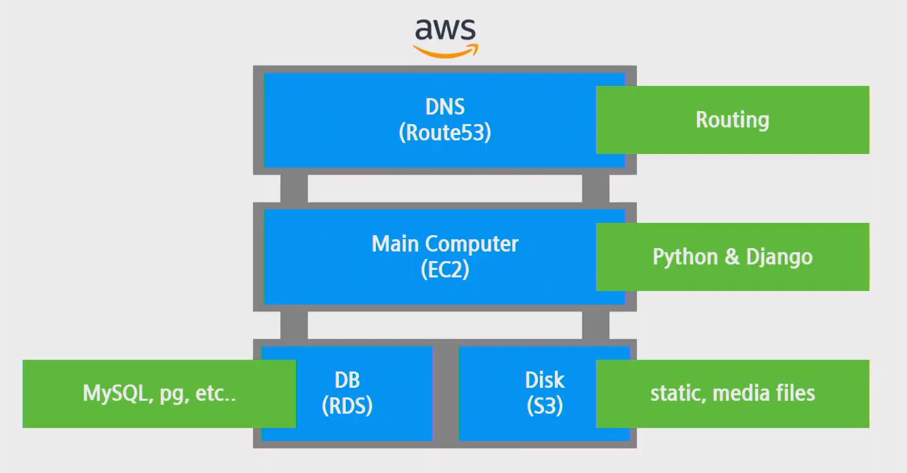
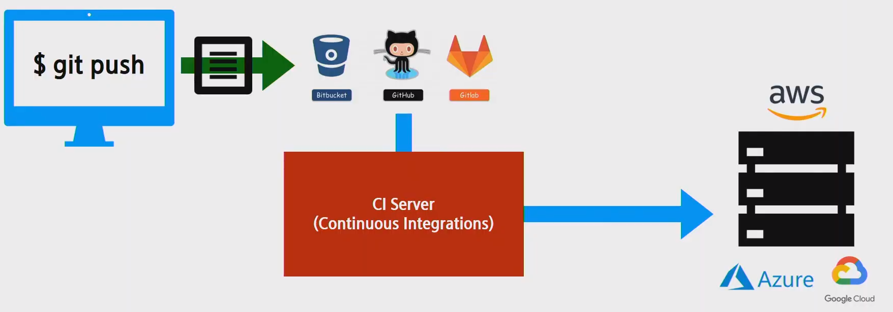
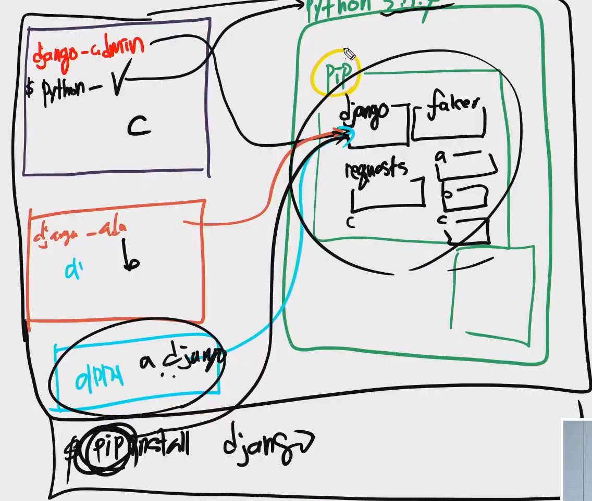

# 배포 (Deployment)

> 배포란?
>
> - what 무엇을 
>   
> - 우리는 서버컴퓨터에서 요청과 응답을 처리할 프로그램을 개발한다.
>   
> - when
>
>   - while alive
>
>   - **분석,계획,설계 => 개발 => 테스트 => 배포(배치) => 운영**
>
>   - TDD - Test Driven Development
>
>     - 코드가 코드를 테스트한다. => T 가 되야함
>     - 
>
>     
>
> - who & where
>   - 누가, 어디에 배치(설치) 하는가?
>   - `Download => .dmg, .exe, .iso, $brew, apt, choco`
>   - Native App
>     - 사용자가 사용자 컴퓨터에 **(설치해야함)**
>   - Web App
>     - 제공자가 제공자 컴퓨터에
>     - 직접 산, 빌린**(Cloud)**
>   - **컴퓨터 빌려주는 플랫폼 ( Cloud Computing Platforms)**
>     - AWS
>     - Azure
>     - Google Cloud
>     - Heroku
>
> - how
>
>   - 
>   - 
>   - DevOps ( 개발과 운영 )
>
>   
>
> - why - In reality
>   - 프로그램을 개발하는 이유?
>     - 사용하기 위해서
>   - SW 배치?
>     - SW 를 사용할 수 있도록 하는 활동
>   - `Real Artists Ship - Steve Jobs`
>     - 진짜 예술가(프로그래머) 는 띄운다. ( 배포한다. )

- Software Deployment - 소프트웨어 배치
  - 배포를 안하면 SW 를 사용할 수 없다.


## :one: 패키지 버전 관리 / 배포

> 로컬PC 에서 개발하고, Cloud(AWS) 를 통해 배포할때 lib 버전 맞춰야 한다.


### :cupid: ​패키지 버전 관리 / 배포

```shell
# 안좋은 예시 ( 이렇게 한다는 뜻 )
$ touch a.packages
django==2.1.15
wrapt==1.12.2

# 버전이 붙어서 lib 정보들이 나온다.
$ pip freeze

# 내가 가진 lib 들을 requirements.txt 라는 이름의 파일로 만든다.
$ pip freeze > requirements.txt # 이름 약속

# requirements.txt 안에 적혀있는 라이브러리 버전들을 설치한다.
$ pip install -r requirements.txt
```


### :cupid: 문제점

- 내 로컬에 있는 lib 를 `클라우드컴퓨터서버` 에서 모두 설치하게 된다.
- 필요없는 라이브러리 까지 설치하게된다.
  - 메모리 낭비
  - 돈 낭비




### :cupid: 해결책

- **가상 환경을 만든다. ( venv ) virtual Enviroment**

- ```shell
  # venv 폴더로 가상환경을 만든다.
  $ python -m venv venv
  
  # 가상환경(독립공간) 생성 / 실행
  # 이 터미널 세션에서는 가상공간 안에 pip 만 쓰겠다.
  # 폴더가 중요한게 아니고, 터미널 단위
  
  $ source venv/bin/activate # Mac, Linux
  $ source venv/Scripts/activate # Windows
  
  # ~/.bashrc 수정하고 적용시키기
  alias va="source venv/Scripts/activate"
  source .bashrc

  # 가상환경 종료
  $ deactivate
  ```
  
- `venv` 폴더를 넘겨주면 안된다.

  - 용량이 매우커서

- :bulb: **순서**

  - 프로젝트 폴더 생성
  - `.gitignore => venv/`
  - `python -m venv venv`
  - `source ../../activate`
  - `pip install django`
  - ....
  - pip freeze > requirements.txt
  -  `requirements.txt` 를 같이 `Git push` 한다.

