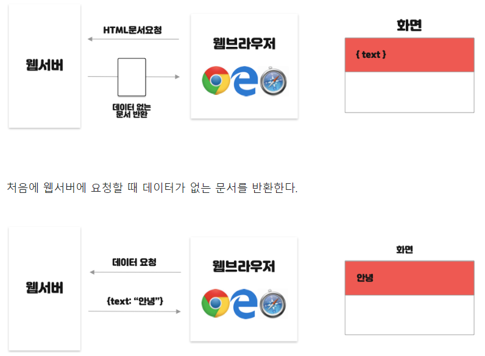
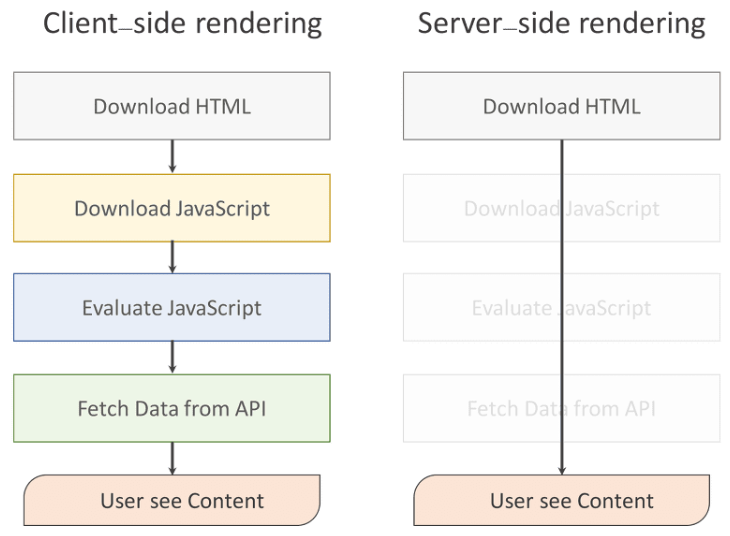
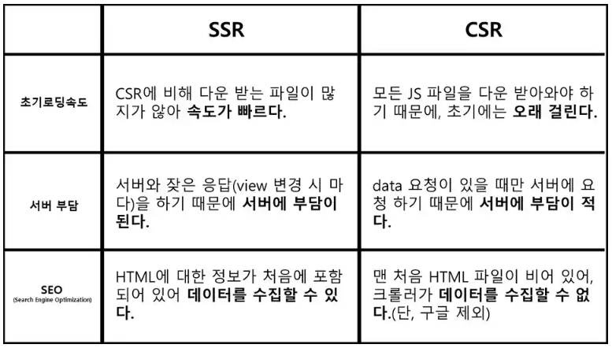

# SSR, CSR

> [출처 - https://velog.io/@namezin/CSR-SSR](https://velog.io/@namezin/CSR-SSR)

## SSR ( Server Side Rendering )

> 완전하게 만들어진 HTML파일을 받아오고 Rendering하게 된다.
>
> 웹서버에 요청할 때마다 Broswer 새로고침이 일어나고 서버에 새로운 페이지에 대한 요청을 하는 방식

- 장점
  - 초기 로딩 속도가 빠르기 때문에 사용자가 컨텐츠를 빨리 볼 수 있다.
  - 모든 검색엔진에 대한 SEO(검색엔진 최적화)가 가능하다.
- 단점
  - 매번 페이지를 요청할 때마다 새로고침 되기 때문에 사용자 UX가 다소 떨어진다.
  - 서버에 매번 요청을 하기 때문에 트래픽, 서버 부하가 커진다.

## CSR ( Client Side Rendering )

> HTML 및 static 파일들이 로드 되면서 데이터가 있다면, 데이터 또한 서버에 요청하고 그것이 화면상에
> 나타나게 된다.
>
> Broswer가 서버에 HTML 과 static파일을 요청한 후 사용자의 상호작용에 따라서 javascript 를 통해 
> 동적으로 Rendering한다. 필요에 따라 데이터를 서버에 요청해서 받아와 Rendering 한다.

- 장점

  - 첫 로딩에 HTML 과 Static 파일들만 다 받으면, 동적으로 빠르게 Rendering하기 때문에
    사용자 UX가 뛰어나다.
  - 서버에 요청하는 횟수가 훨씬 적기 때문에 서버 부담이 덜하다.

- 단점

  - 모든 HTML 과 Static파일이 로드될 때까지 기다려야 한다.
    (리소스를 Chunk(청크) 단위로 묶어서 요청할 때만 다운받게 하는 방식으로 완화시킬 수는 있지만
    해결할 수는 없다.)
  - SEO(검색엔진 최적화) 문제가 발생할 수 있다.
    (검색엔진이 크롤링 하는데 어려움을 겪기 때문에, 구글 검색엔진은 Javascipt까지 크롤링을 하지만 다른 검색엔진의 경우 그렇지 않다.)

  

## SSR, CSR 비교

## SPA, MPA

- 출처참조

## SPA에서 SSR을 구성할 수는 없는가.

- 출처참조

## 결론

SSR과 CSR을 적절히 활용해야 한다.

처음에만 SSR을 하고 그 이후에 CSR을 하는 경우는 그다지 SEO(검색엔진 최적화) 에 도움이 되지 않는다.

UX에 지장이 가지 않는 선에서 페이지를 나누고, 기존 SPA에서 하던 CSR로 구성하는 것도 좋다.

## 