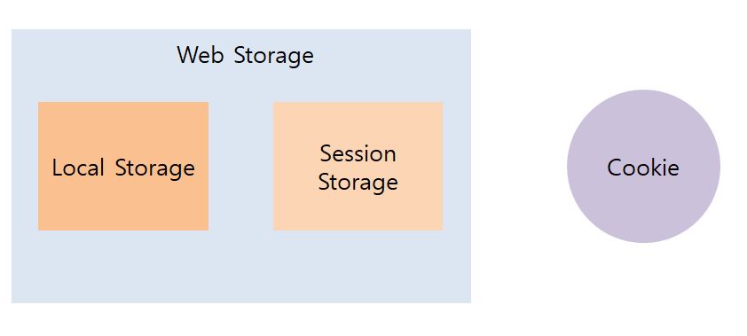

# Local & Cookie & Session 비교

> - ref
>   - [1. 쿠키 vs 로컬스토리지 vs 세션스토리지](https://kadamon.tistory.com/8)
>   - [2. 쿠키 세션 로컬 비교](https://seunghyun90.tistory.com/43)
>   - [3. 로컬, 세션, 쿠키 차이점 벨로그]([https://velog.io/@ejchaid/localstorage-sessionstorage-cookie%EC%9D%98-%EC%B0%A8%EC%9D%B4%EC%A0%90](https://velog.io/@ejchaid/localstorage-sessionstorage-cookie의-차이점))
>   - [4. 개발자들을 위한 도구 - 쿠키 세션 로컬]([https://velog.io/@carminchameleon/%EA%B0%9C%EB%B0%9C%EC%9E%90%EB%8F%84%EA%B5%AC1](https://velog.io/@carminchameleon/개발자도구1))
>   - [5. 쿠키는 구식, 이제는 웹스토리지]([https://kamang-it.tistory.com/entry/Web%EC%A1%B0%EA%B8%88-%EB%8D%94-%EC%9E%90%EC%84%B8%ED%9E%88cookie%EB%8A%94-%EB%84%88%EB%AC%B4-%EA%B5%AC%EC%8B%9D%EC%95%84%EB%83%90-%EC%9D%B4%EC%A0%9C%EB%B6%80%ED%84%B4-Web-Storage](https://kamang-it.tistory.com/entry/Web조금-더-자세히cookie는-너무-구식아냐-이제부턴-Web-Storage))

## 1. WebStorage - Local

> 웹스토리지는 HTML5 에서 쿠키의 단점을 보완해서 만든 기술이다.
> 기본적으로 `웹스토리지`는 `key`와 `value`로 이루어져 있다. 
> 쿠키와 마찬가지로 클라이언트에 대한 정보를 저장한다.

웹 스토리지와 쿠키의 역할 자체에는 크게 차이가 없다고 생각한다. 
하지만 최근에는 웹스토리지가 쿠키보다 효율적이지 않나? 라는 의견이 많다.
저장용량에서도 쿠키는 4kb 안되지만 로컬스토리지는 약 5Mb(브라우져마다 차이있음) 정도 까지 가능하고,
서버로 전송을 안하기 때문에 그런 생각이 많은 것 같다.

웹스토리지에서 쿠키의 가장 큰 차이점은 서버에 클라이언트에 대한 데이터를 저장하지 않는 것이다.
웹스토리지는 자기 로컬영역에만 저장을 해두고 해당하는 key값에 해당하는 value값들을 비교 및 유지하는 형식이지만 쿠키는 서버와 자신의 로컬 영역에 저장을 해두고 비교를 할때마다 일종의 쿠키용 api를 만들어 호출하는 방식인것 같다.

#### LocalStorage

로컬스토리지는 웹스토리지의 두 가지 종류중 하나이다.

클라이언트에 대한 정보를 영구적(강제로 지우지 않는 이상)으로 보관하는 것이 세션스토리지와 큰 차이점이고,
그 외에는 모두 동일하다고 한다.

## 2. Cookie

> 쿠키는 클라리언트에 대한 정보를 이용자의 PC 하드디스크에 보관하기 위해서 웹 사이트에서 클라이언트의 웹 브라우저에 전송하는 정보이다.

쉽게 생각하면 **통행증** 정도로 생각하면 편하다.
`로그인 기능` 을 구현할 때 요즘은 대부분 토큰을 사용한다.
이 토큰은 로그인 시 고유하게 가지고 있는 unique 한 값을 가지게 된다. 여기서 토큰은 사람에 대한 **신분증**이라고 하자. 옛날에는 다른 도시를 지나가려면 통행증이 필수적으로 필요하다. 그러면 통행증을 가지고 있으면 그 도시는 언제든지 마음대로 왕복할 수 있다. 통행증을 발급받으려면 신분증이 필요한 것이다.

`쿠키를 발급받으려면 토큰이 필요한 것`

웹에서는 로그인을 하기위해서는 항상 토큰을 발급받는 API를 사용해야 할 것이다.
근데 서비스를 이용하다 보면 토큰을 반드시 매개변수로 보내야하는 경우가 있다.
이런 경우 토큰을 매번 생성한다면 api하나 호출하기 위해서 토큰을 얻는 api를 또 호출하는 쓸데없는 일이 반복
그래서 쿠키라는 통행증을 얻는 것이다.

로그인이 성공할 경우 토큰에 해당하는 쿠키를 서버와 클라이언트에 생성하고,
**클라이언트는 토큰이 아닌 쿠키를 통해 서버에 요청을 하는 것이다.**
즉, 매번 토큰을 받는 api를 호출할 필요가 없어지는 것이다.

## 3. Session Storage

> 세션스토리지 역시 웹스토리지의 종류 2가지 중 하나이다.

세션스토리지는 로컬스토리지와 다르게 세션이 종료되면 (즉 브라우저를 닫을 경우) 클라이언트에 대한 정보를
삭제하는 것이다. 보안이 많이 필요한 녀석들 일 수록 `세션스토리지`를 쓰는게 좋을 것으로 생각된다.

## 4. Web Storage 의 차이점 ( Cookie 와 비교 )

- 쿠키는 매번 서버로 전송된다.

  - 웹 사이트에서 쿠키를 설정하면 이후 모든 웹 요청은 쿠키정보를 포함하여 서버로 전송된다.
    Web Sotrage는 저장된 데이터가 클라이언트에 존재할 뿐 서버로 전송은 이루어지지 않는다.
    이는 네트워크 트래픽 비용을 줄여 준다.

  

- 단순 문자열을 넘어(스크립트) 객체정보를 저장할 수 있다.

  - 문자열 기반 데이터 이외에 체계적으로 구조화된 객체를 저장할 수 있다는 것은 개발 편의성을
    제공해주는 주요한 장점이 된다. 브라우저의 지원 여부를 확인해 봐야 하는 항목이다.

  

- 용량의 제한이 없다.

  - 쿠키는 개수와 용량에 있어 제한이 있다.
    하나의 사이트에서 저장할 수 있는 최대 쿠키 수는 20개이다.
    그리고 하나의 사이트에서 저장할 수 있는 **최대 쿠키 크키는 4KB로 제한**되어 있다.
    **그러나** Web Storage 는 이러한 제한이 없다.
  - 쿠키도 하위키를 이용하면 이러한 제한을 일부 해소할 수 있다. 하지만 대부분 쿠키의 제한으로까지
    데이터를 저장할 일이 없다.

## 5. 정리

**Cookie**

- 장점
  - 어지간한 브라우저에는 지원이 다 된다.
- 단점
  - api가 한번 더 호출되므로, 서버부담증가 / 쿠키자체의 용량이 적음

**Local Storage**

- 장점
  - 서버에 불필요하게 데이터 저장안함 / 용량이 큼
- 단점
  - HTML4 만 지원되는 브라우저면 지원이 안됨

**Session Storage**

- 장단점
  - Local Storage 와 동일하지만, 기능차이만 존재한다. (브라우저 닫으면 세션정보 사라짐)

