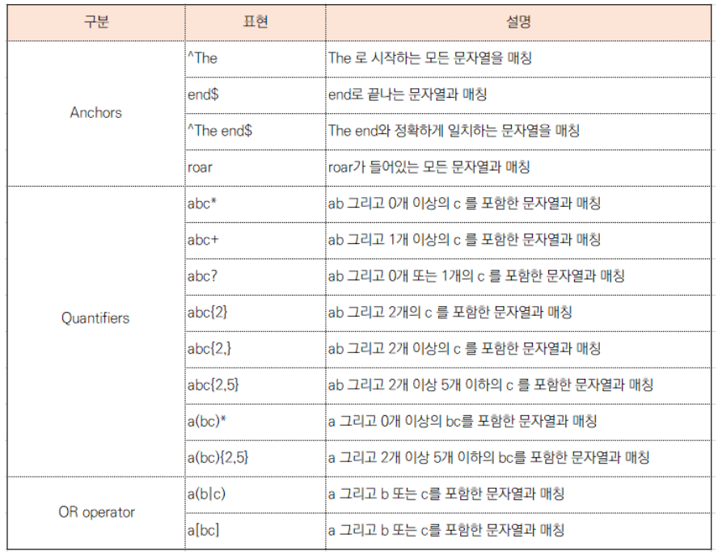
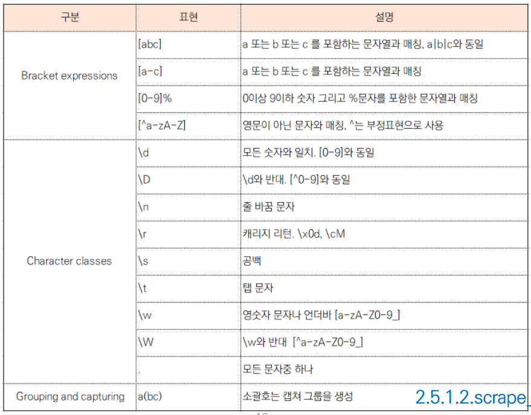

# 정규 표현식 (Regular Expressions)

> - **정규식 (Regex 또는 Regexp)** 이란?
>   - 특정 검색 패턴(ASCII 또는 Unicode 문자의 시퀀스)에 대한 하나 이상의 일치 항목을 검색
>   - **검색된 텍스트로부터 정보를 추출하는데 매우 유용하게 사용가능한 표현식**
>   - 유효성 검사에서 문자열 파싱 및 대체
>   - 데이터를 다른 형식으로 변환 및 웹 스크래핑에 이르기까지 다양한 응용분야에서 활용
>   - 프로그래밍 언어(Python, Javascript, Java, C) 와 텍스트에디터(vi, notepad++, 등)에 적용 가능


## 1. 정규식 패턴

[점프 투 파이썬](https://wikidocs.net/1669)

[표]




[표2]




## 2. 사용하는 상황

```
주민번호를 포함하고 있는 텍스트가 있다. 이 텍스트에 포함된 모든 주민번호 뒷자리를 * 문자로 변경해보자.
```


- [방법1 - 정규식을 모를때]
  - 전체 텍스트를 공백 문자로 나눈다(split).
  - 나뉜 단어가 주민등록번호 형식인지 조사한다.
  - 단어가 주민등록번호 형식이라면 뒷자리를 `*`로 변환한다.
  - 나뉜 단어를 다시 조립한다.

```python
data = """
park 800905-1049118
kim  700905-1059119
"""

result = []
for line in data.split("\n"):
    word_result = []
    for word in line.split(" "):
        if len(word) == 14 and word[:6].isdigit() and word[7:].isdigit():
            word = word[:6] + "-" + "*******"
        word_result.append(word)
    result.append(" ".join(word_result))
print("\n".join(result))

# 결과값:
park 800905-*******
kim  700905-*******
```


- [방법2 - 정규식을 사용할 때]

```python
import re 

data = """
park 800905-1049118
kim  700905-1059119
"""

pat = re.compile("(\d{6})[-]\d{7}")
print(pat.sub("\g<1>-*******", data))

# 결과값:
park 800905-*******
kim  700905-*******
```


hihi