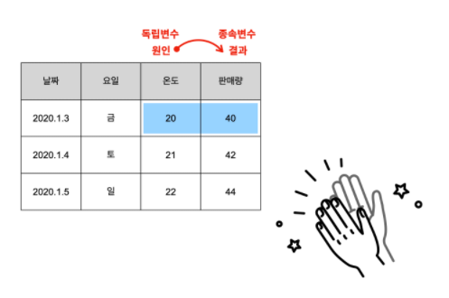
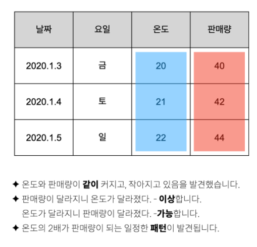
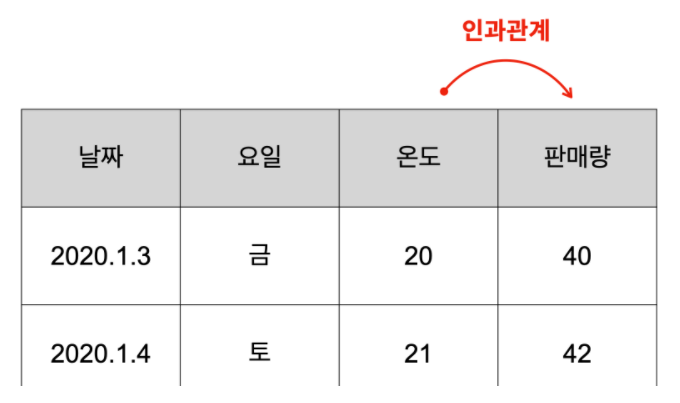
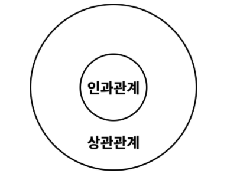

# 독립변수 & 종속변수

> 표(DataFrame)의 데이터에서 의미있는 정보를 뽑아낼 수 있어야 한다.
>
> 이에 대한 능력을 기르기 위해서는 **독립변수와 종속변수**라는 말의 의미를 이해하는 것이다.


```python
# 1차 함수
y = x + 1

# y는 종속변수 ( x값에 따라 y가 바뀌므로 )
# x는 독립변수
```




## 1. 독립변수 VS 종속변수

- 독립변수
  - 원인이 되는 열
- 종속변수
  - 결과가 되는 열


[예시]

**'온도가 20도일 때 40잔이 팔렸다.'**

여기서 원인은 온도 20 이고, 결과는 판매량 40잔입니다.

잘 생각해보면 <u>원인은 결과와 상관없이 일어나는 사건</u>입니다.

( 판매량 때문에 온도가 달라지진 않는다. )


결과에 영향을 받지 않는 독립적인 사건입니다.
하지만 결과는 원인에 종속되어서 발생한 사건입니다.

그래서 원인은 독립적이기 때문에 **'독립변수'**
결과는 원인에 종속되어 있기 때문에 **'종속변수'**라고 합니다.

표를 만났을 때, 우리의 머릿속에는 이 생각이 가장 먼저 떠올라야 합니다.


## 2. 상관관계 & 인과관계

#### 상관관계

한쪽의 값이 바뀌었을 때, 다른 쪽의 값도 바뀐다면, 두개의 특성은 '서로 관련이 있다.'라고 추측할 수 있습니다.
이때 두 개의 특성을 '서로 상관이 있다.' 라고 합니다.

그리고 이런 관계를 **상관관계**라고 합니다.


#### 인과관계

그런데 잘 살펴보면 온도와 판매량 사이에 보다 미묘한 관계가 있는 것을 관찰할 수 있습니다.



이런 사실을 종합하면 '온도'는 '원인'이고,
'판매량'은 '결과'라고 할 수 있습니다.




이렇게 각 열이 원인과 결과의 관계일 때,

인과관계가 있다고 합니다.


상관관계와 인간관계는 비슷한 듯 하지만 중요한 차이가 있습니다.


아래 그림과 같이 상관관계는 인과관계를 포함합니다.



즉, **모든 인과관계는 상관관계입니다.**

하지만, 모든 상관관계가 인과관계인 것은 아닙니다.


[정리]

```
1. 독립변수는 원인이다.
2. 종속변수는 결과다.
3. 독립변수와 종속변수의 관계를 인과관계라고 한다.
4. 인과관계는 상관관계에 포함된다.
```


