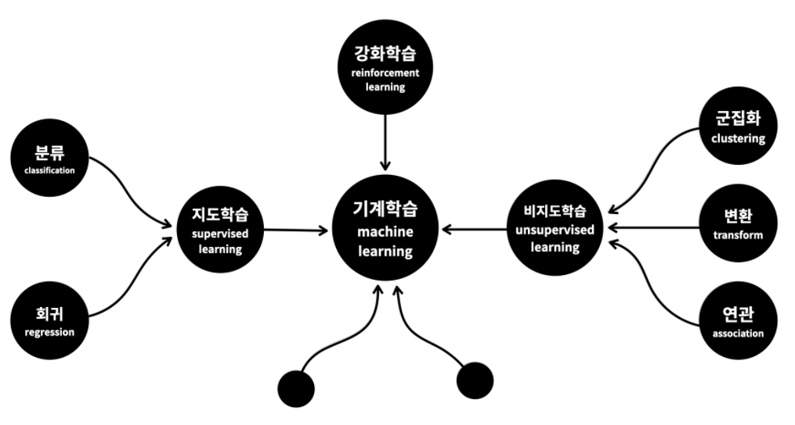

# 머신러닝의 분류

- **기계학습(ML)**
  - 지도학습
    - 분류
    - 회귀
  - 비지도학습
    - 군집화
    - 변환
    - 연관
  - 강화학습

## 1. 지도학습 (Supervised Learning)

기계를 가르친다. 문제집을 푸는것과 비슷하다.
문제와 정답을 비교하고, 맞추다보면 점점 문제를 푸는것에 익숙해진다. ( **분류, 회귀** )
비슷한 문제를 만나면 오답을 할 확률이 낮아진다. 
문제집으로 학생을 가르치듯이 데이터로 컴퓨터를 학습시켜서 모델을 만드는 방식을 **'지도학습'**이라 합니다.

