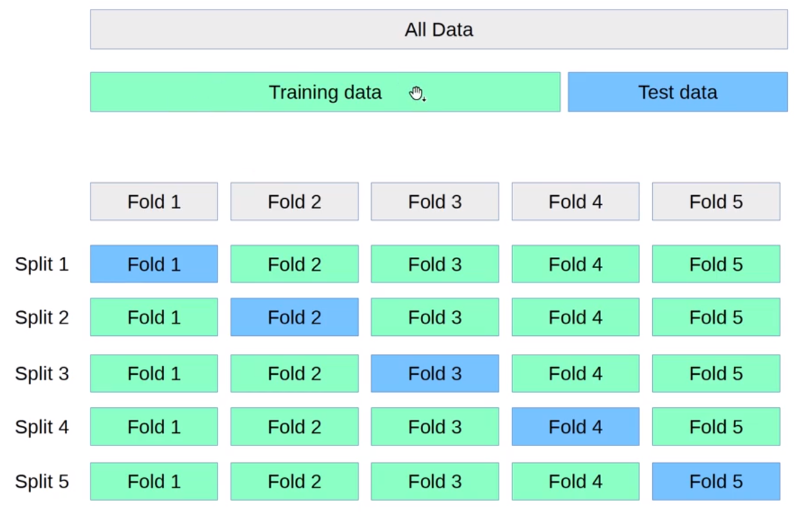
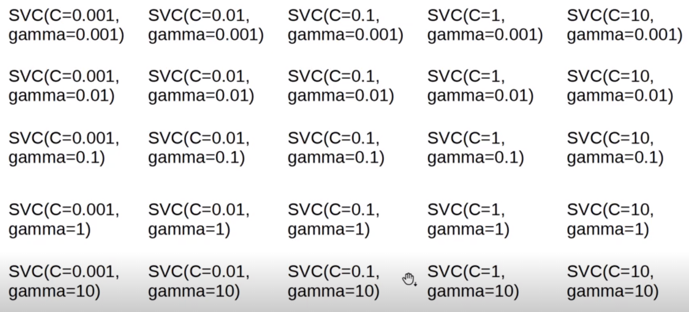
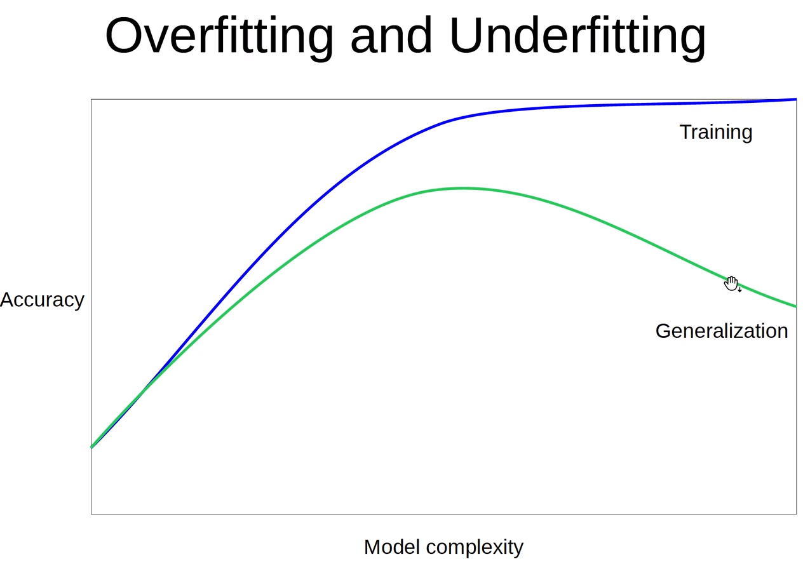
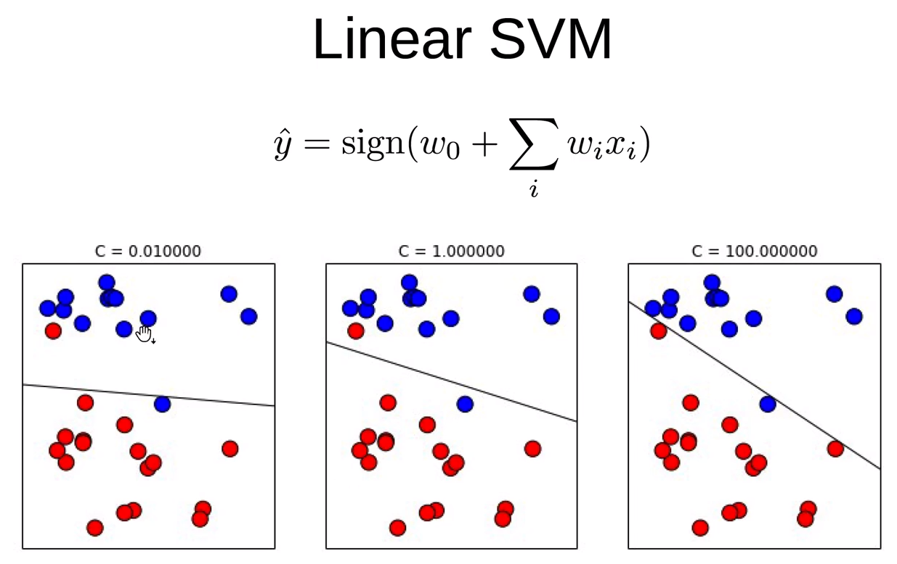

# 지도학습
문제에 대한 정답을 이미 알고 있을 때,
- Training Data
- Training Labels

Model 을 만들고

- Test Data

만든 Model 로 Prediction(예측) 한다.

- Test Labels

Evaluation(평가) 한다.

Train Data로 학습해서 모델을 만들고 Test Data로 만든 모델을 평가한다.


## 랜덤포레스트 분류


```python
from sklearn.ensemble import RandomForestClassifier

clf = RandomForestClassifier()

clf.fit(X_train, y_train) # 문제와 정답을 같이 넣어준다.
y_pred = clf.predict(X_test)
clf.score(X_test, y_test)
```


```python
clf
```


    RandomForestClassifier()


# 비지도 학습
정답데이터가 없다. 군집화 / 차원축소에서 비지도학습을 사용하게 된다.<br>
군집화 문제는 쇼핑몰에서 비슷한 고객끼리 묶어서 고객군을 알게되면,<br>
그 비슷한 고객들에게 물건을 추천한다. ( 프로모션 한다 )

- `Training Data`

로 Model 을 만든다.

- `Test Data`

로 새로운 View 를 만든다.

## 비지도 트랜스포메이션

- PCA
    - 차원축소 방법중에 하나


```python
pca = PCA()

pca.fit(X_train)

X_new = pca.transform(X_test)

# pca로 차원이 축소되면, 시각화나 머신러닝의 피처로 사용할 수 있게 된다.
```

# Basic Api

- `estimator.fit(X, [y])` : X 값은 필수, [y] 는 선택

- `estimator.predict`
    - Classification
    - Regression
    - Clustering
    
- `estimator.transform`
    - Preprocessing
    - Dimensionality reduction
    - Feature selection
    - Feature extraction


## 과정




- Cross Validation
  - `K-폴드 교차검증`
    - 가장 효과적인 파라미터를 찾기
    - 어떤 파라미터가 가장 좋은 성능을 내는 지 찾는다.




- Grid Search


# Overfitting VS Underfitting




- `Overfitting`
  - 공부를 많이하면 많이 할수록 Train Data에 대한 예측이 높아진다.
  - Test Data는 어느순간부터 성능이 안좋아지게 된다.
  - Train Data에 너무 맞춰져 있기 때문에 새로운 데이터가 들어왔을때 예측력이 낮아진다.


- `Underfitting`
  - 공부를 적게 한것.

```
- 오버피팅
기출문제에 익숙해져있어서 기출문제는 잘푸는데
새로운 문제는 잘 적용을 못하는 문제

- 예시
학원에서 공부해서 학원에서는 100점
실제 학교에서는 100점을 맞을거같았는데 사실 80점을 맞는경우

학원공부에 너무 오버피팅 되어있다.
```


# SVM




분류문제일때, 고객이 구매한다. 안한다 


3개에 모델중에서 어떤 모델이 가장 값을 가장 잘 판별하는 지 찾고싶다. 

서로 다른 파라미터 값이 들어가고 있다.


```
의사결정나무(Decision Tree)에서 트리의 깊이가 깊어질수록 오버피팅 확률이 올라간다.
```


# Random Forests

> 의사결정나무를 여러개 만든다.
>
> 의사결정나무가 좋은성능을 내는 알고리즘이라서, 이러한 모델을 여러개를 만들면 더 좋은 성능을 내겠다는 아이디어에서 시작되었다.
>
> 모든 데이터를 사용하지않고 `부트스트래핑`이라는 과정을 통해 데이터를 샘플링해서 예측을 하게된다.
>
> 트리깊이 깊어질수록 오버피팅 가능성 높다.


# Tree 베이스 모델

분류와 회귀 모두에 사용할 수 있다.

- DecisionTree
- RandomForest
- GradientBoosting

# Linear 베이스 모델

- LogisticRegression : 분류 가능
- Ridge
- ...

# Score

- 회귀
  - R2 스코어
- 분류
  - Accuracy