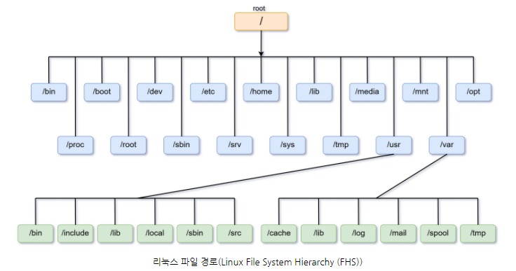
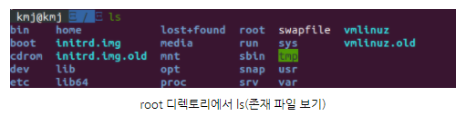
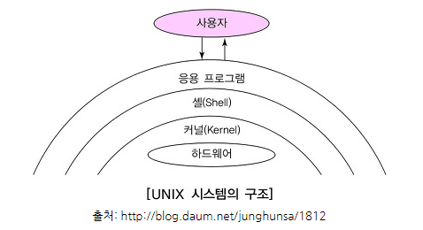
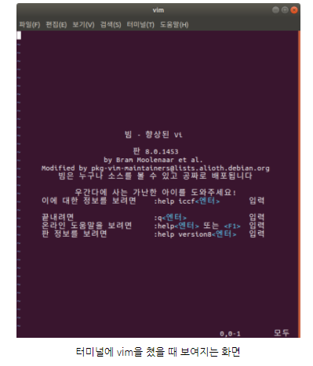

# 리눅스 & 터미널 기초

> - ref
>   - [티스토리](https://kim-mj.tistory.com/224?category=879202)


## 1. 리눅스 개요

- 리눅스(Linux)는 1991년 Linus Torvals가 개발
- 시스템을 운영하는 데 가장 널리 사용되는 운영체제
- 누구나 다 코드를 볼 수 있는 오픈소스
- 시스템 서버는 리눅스 기반으로 운영됨
- 시스템을 유지하고 관리하기 때문에 잘 알아야 한다.


## 2. 리눅스의 루트 경로

먼저 리눅스의 파일 구조를 보면 아래와 같이 tree 형태로 되어 있는 걸 알 수 있다.



리눅스의 가장 위에는 `/`, Root 디렉토리(directory)가 존재한다.

그 외 각 하위 디렉토리들은 slash(`/`) 로 구분한다.




디렉토리 간의 이동은 `cd 디렉토리명` 으로 할 수 있다. (ex. cd home)

```shell
$ cd ~
```


#### 리눅스의 홈 디렉토리란?

home 디렉토리는 유저가 많은 것을 할 수 있는 유저의 공간으로, 가장 중요하고 기본이 되는 디렉토리이다.
home 디렉토리 외 다른 디렉토리들은 주로 system directory 라고 한다.


#### 리눅스의 절대경로와 상대경로

- **절대경로(Absolute Path)**
  - 완전한 경로의 의미로, root 디렉토리부터 시작하는 경로를 뜻함 (ex. /home/eun/bin)
  - 현재 나의 위치와 상관없이 절대경로를 통해 해당 위치로 갈 수 있다.
- **상대경로(Relative Path)**
  - 현재 나의 위치를 기반으로 움직이는 경로이다.
  - 여기서 기억해야 할 심볼은 `.` 와 `..` 이다.
  - `.` (single dot) 은 현재 디렉토리를 뜻하며, `..` 는 현재 디렉토리의 상위 디렉토리를 뜻한다.


`절대경로와 상대경로` 는 html, css, js 파일 경로를 설정할 때에도 사용된다.

html 파일이 최상단 폴더에 있다면 보통 절대경로로 다른 css, js 위치를 설정한다.


#### 환경변수

환경변수(Environement Variable)의 의미를 알아보자.

variable은 말 그대로 어떤 값을 저장하고 있는 변수이고, 여기서 뜻하는 environement는 터미널이 돌아가고 있는 Shell 을 말한다. 윈도우 고급 설정의 환경변수(내컴퓨터 - 우클릭 - 속성 - 고급 시스템 설정 - 환경변수) 에 저장되어 있는 것과 같은 역할을 한다.




shell 은 사용자가 커널, 하드웨어와 커뮤니케이션을 도와주는 것이다. (Window는 bash가 기본 shell로 되어 있다)

```shell
echo $SHELL # 현재 어떤 운영체제인지 알 수 있음
```

따라서 환경변수는 shell의 어떠한 설정 값을 가지고 있는 변수를 뜻하고, 이러한 환경변수는 shell이 돌아가는 동안 계속 존재하고 사용할 수 있다.


#### Home 환경변수

```shell
$ echo $HOME
```

우리가 Home이라는 환경변수를 선언하진 않았지만, shell이 시작할 때 자동으로 선언했기 때문에 존재하는 것을 확인 할 수 있다.


#### PATH 환경변수

path 명령어들의 실행파일을 찾는 경로를 저장해 놓은 환경변수이다.

우리가 흔히 쓰는 `ls, cd` 모두 환경변수에 속하며 `whereis 환경변수` 를 쓰면 어느 디렉토리에 있는 확인  가능함


#### [기타]

##### 리눅스에서 .파일은 무엇이며 해당파일을 보려면 어떻게 해야 하나요?

.파일(닷파일)은 숨겨진 파일을 뜻한다.

해당 파일을 보기 위해서는 `ls -a` 을 쳐서 숨겨진 파일 모두 나열하면 된다.


#### Vim

vim은 리눅스에서 자주 쓰이는 편집기 중 하나이다.



처음에 vim은 다루기 힘든 메모장처럼 느껴진다.

종료할 때도 esc가 아닌 `:q` 로 나와야 하는 것도 잊지 말자.


#### [명령어]

##### 자주 쓰임

- `cd`
  - 디렉토리를 변경
- `ls` : 현재 디렉토리에서 파일 목록보기
  - `ls -a` : 숨겨진 파일목록 보기(all)
  - `ls -al` : 숨겨진 파일목록 길게 보기 (all, long)
- `cp`
  - 파일이나 디렉토리 복사 (copy)
- `mv`
  - 파일이나 디렉토리 이동 (move)
- `pwd`
  - 현재 경로 표시 (directory), print working directory
- `mkdir`
  - 디렉토리 생성 (make directory)
- `cat`
  - 파일 내용 표시
- `clear`
  - 터미널 정리


##### 자주 안쓰임

- `man`
  - 지정 명령어의 메뉴얼 출력
- `head`
  - 문서의 머리 부분 출력
- `tail`
  - 문서의 꼬리 부분 출력
- `chown`
  - 파일의 소유자 지정
- `chmod`
  - 파일의 사용 허가 지정 (change mode)
  - chomod 소유자권한, 그룹사용자권한, 기타그룹권한
- [`grep`](https://geundi.tistory.com/113)
  - 문자열 존재여부 검색