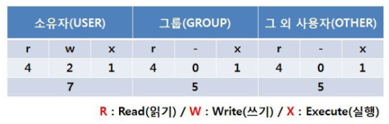
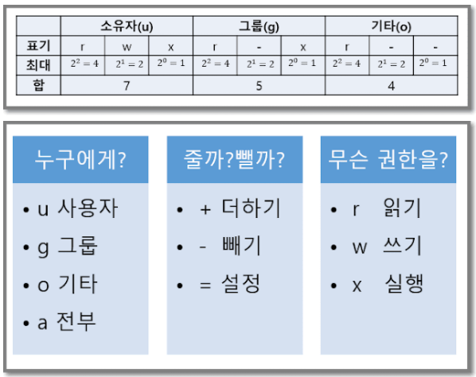

# 퍼미션 (Permission) 활용

> - ref
>   - [리눅스 기초 및 기본 명령어 총정리](http://cocotp10.blogspot.com/2018/01/linux-centos7.html)

리눅스의 모든 파일과 디렉토리는 퍼미션들의 집합으로 구성되어 있다.

이러한 Permission은 시스템에 대한 읽기, 쓰기, 실행에 대한 접근 여부를 결정한다.
(`ls -l` 로 확인 가능)


## 1. 접근 통제 기법

- **DAC (Discretionary Access Control)**

  - 객체에 대한 접근을 사용자 개인 or 그룹의 식별자를 기반으로 제어하는 방법

  > 운영체제 (윈도우, 리눅스)

- **MAC (Mandotory Access Control)**

  - 모든 접근 제어를 관리자가 설정한대로 제어되는 방법

  > 관리자에 의한 강제적 접근 제어

- **RBAC (Role Based Access Control)**

  - 관리자가 사용자에게는 특정한 역할을 부여하고, 각 역할마다 권리와 권한을 설정

  > 역할 기반 접근 제어


## 2. 퍼미션 카테고리



> r : 읽기
>
> w : 쓰기
>
> x : 실행
>
> -: 권한없음


```
-rwxrw-r--. 1 root root 2104 1월 20 06:30 passwd
```

- `-rwx` : 소유자
- `rw-` : 관리 그룹
- `r--` : 나머지
- `1` : 링크 수
- `root` : 소유자
- `root` : 관리 그룹
- `2104` : 파일 크기
- `1월 20 06:30` : 마지막 변경 날짜/시간
- `passwd` : 파일 이름


## 3. 퍼미션 모드

##### 1) 심볼릭 모드




명령어 : `chmod [권한] [파일이름]`

> 그룹(g)에게 실행 권한(x)를 더할 경우
>
> `chmod g+x`


##### 2) 8진수 모드

chmod 숫자 표기법은, 0~7까지의 8진수 조합을 사용자(u), 그룹(g), 기타(o) 에 맞춰 숫자로 표기하는 것이다.

> r = 4 / w = 2 / x = 1 / - = 0


