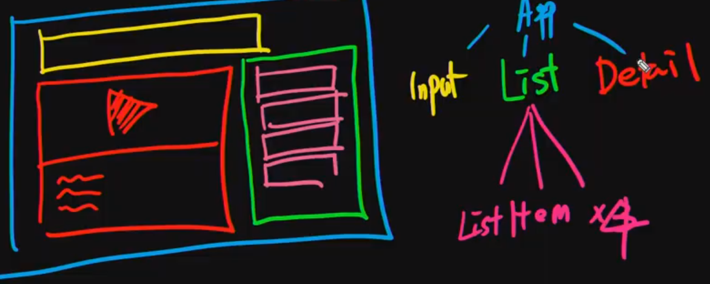
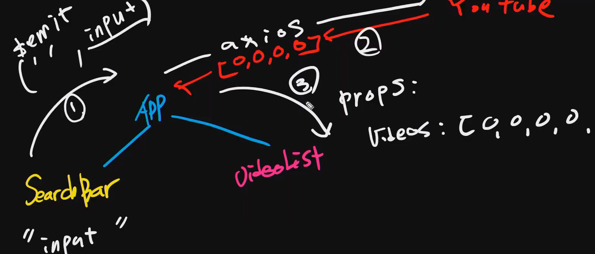
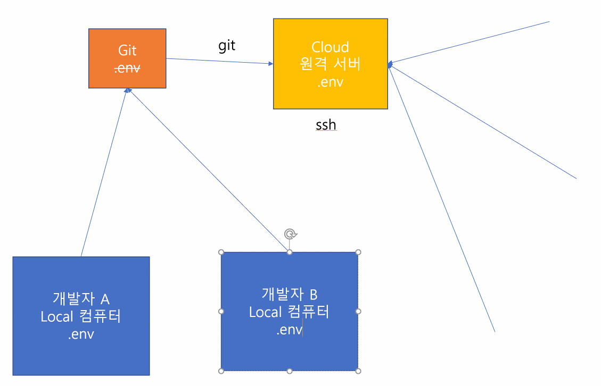

# Youtube


## :one: Youtube Broswer




[유튜브 v3 Search](https://developers.google.com/youtube/v3/docs/search/list)





- App.vue (부모)

```html
<template>
  <div class="container">
    Youtube Broswer 를 만들겠다!!!!
    <!-- emit 2. 듣고,  -->
    <SearchBar @input-change="onInputChange" />
    <VideoList :videos="videos" />
  </div>
</template>

<script>
import axios from 'axios'

import SearchBar from './components/SearchBar.vue'
import VideoList from './components/VideoList.vue'

const API_KEY = '본인 키'
const API_URL = 'https://www.googleapis.com/youtube/v3/search'

export default {
  name: 'App',
  components: {
    SearchBar,
    VideoList,
  },
  data() {
    return {
      inputValue: '',
      videos: [],
    }
  },
  methods: {
    onInputChange(inputText) {
      this.inputValue = inputText
      // emit => data 를 수정
      axios.get(API_URL, {
        params: {
          key: API_KEY,
          part: 'snippet',
          type: 'video',
          q: this.inputValue,
        }
      })
        .then(res => this.videos = res.data.items)
        .catch(err => console.error(err))
    }
  },
}
</script>

<style>

</style>
```


- SearchBar.vue
  - 사용자입력을받아서 `$emit` 을통해 부모(App.vue) 에 전달

```html
<template>
  <div>
    <input @keypress.enter="onInput">
  </div>
</template>

<script>
export default {
  name: 'SearchBar',
  methods: {
    onInput(event) {
      // emit 1. 위로 커스텀 이벤트를 쏜다.
      this.$emit('input-change', event.target.value)
    }
  },

}
</script>

<style>

</style>
```


- VideoList.vue
  - `App.vue` 부모한테 받은 데이터 props

```html
<template>
  <div>
    <h1>Video List</h1>
    <ul>
      <li v-for="video in videos" :key="video.etag">
        {{ video.snippet.description }}
      </li>
    </ul>
  </div>
</template>

<script>
export default {
  name: 'VideoList',
  props: {
    videos: Array,
  }
}
</script>

<style>

</style>
```


## :two: Key 관리 (.env)




## :three: vue 프로젝트 클론

> - Vue 프로젝트
>
> 클론받은후에 `npm install` 로 NPM 모듈을 설치하게 되고. 
>
> 그다음 npm run serve 가능해진다.


## :four: Vue CLI 환경변수 설정

> 숨기고싶은 KEY 등
>
> `.env.local` 파일 생성 ( 루트 디렉토리에 )


- `.env.local`

```
VUE_APP_YOUTUBE_API_KEY='Your Youtube API KEY'
```

