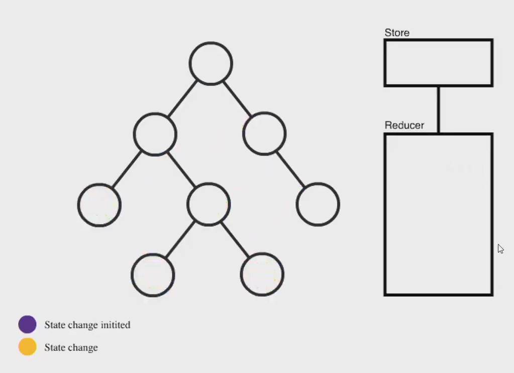

# Vuex

> [참고문서](https://vuex.vuejs.org/kr/)
>
> 서비스가 커질수록 vuex (Store) 가 필요해진다..




## 준비

```shell
$vue add vuex
```


:cupid: **[Vuex](https://vuex.vuejs.org/kr/)**

> 상태 관리 패턴 + 라이브러리
>
> 애플리케이션의 **모든 컴포넌트에 대한 중앙 집중식 저장소 역할(Store)** 을 한다.


- 쓰는 이유
  - 여러 뷰는 같은 상태에 의존한다.
  - 서로 다른 뷰의 작업은 동일한 상태(data, state)를 반영해야 할 수 있습니다.
  - 최상위 부모 컴포넌트가 데이터를 관리하는게 단방향데이터 흐름에 적합하긴 하나
    서비스의 규모가 커지게되면 props & emit 이 빈번해지고 복잡해지므로 
    데이터(상태)를 중앙집중식으로 관리해서 그곳과 데이터를 소통하는게 편하다
  - 그것을 도와주는것이 Vuex 이며 Store 공간이다.