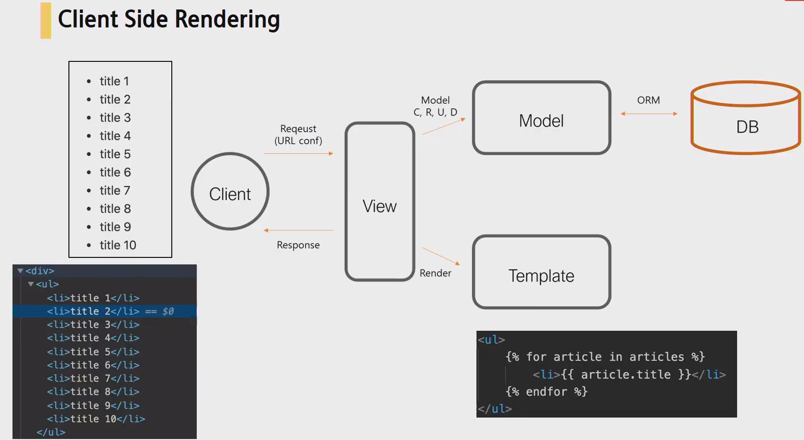
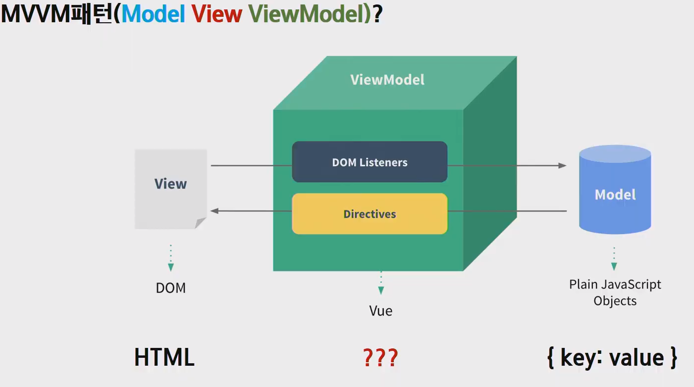

# Vue.js

> Evan You 라는 사람이 만듦
>
> Angular.js 에서 무거운 개념들을 다 덜어내자.


**What**

- Front-End Framework

- SPA (Single Page Application) 제작

- Client-side rendering

  - 
  - **서버는 데이터를 던지고, 브라우저가 받고 만든다.**
  - 예전에는 서버가 만들어서 줬지만, 이제는 코드만 던져주고 브라우저가 받고 만든다.

  

- MVVM패턴

  - Model View ViewModel
  - 

  

- Reactive (반응형의) / Declarative(선언형의)

  - 페이스북 UI 프론트엔드
  - 한명의 친구를 차단을 하면 프론트엔드단에서는 많은 변화가 있어야함..


**Why**

- 배우기 쉽다.
- 돈이 덜든다.
- UX 향상
- 프레임워크(프렌차이즈)의 장점(DX 향상)
  - No etc, 선택과 집중
  - 유지/보수 용이
  - 커뮤니티와 라이브러리


**How**

- 코드확인

```html
<div id="app">
    
</div>

<script>
const app = new Vue({
    el: '#app',
    data: {},
    methods: {},
    computed: {},
    watch: {},
    
    // Life Cycle Hook
    created: {},
    mounted: {},
    ...
})
</script>
```


## :one: 설치

> - React 와 Vue 는 많은 공통점을 공유한다.
>
>   - 가상 DOM을 활용한다.
>   - 반응적이고 조합 가능한 컴포넌트를 제공한다.
>   - 코어 라이브러리에만 집중하고, 라우팅 및 전역상태를 관리하는 컴패니언 library가 있다.
>
> - CDN
>
>   - ```html
>     <script src="https://cdn.jsdeliver.net/npm/vue/dist/vue.js"></script>
>     ```


**확장프로그램**

- VSCode

  - `Vetur` 

    - Vue.js 개발을 위한.. 코드작성 도움

    

- 크롬 확장 프로그램
  - [`Vue.js devtools`](https://chrome.google.com/webstore/detail/vuejs-devtools/nhdogjmejiglipccpnnnanhbledajbpd/related)
  - 파일 url에 대한 액세스 허용 체크하기 ( 옵션설정 )


