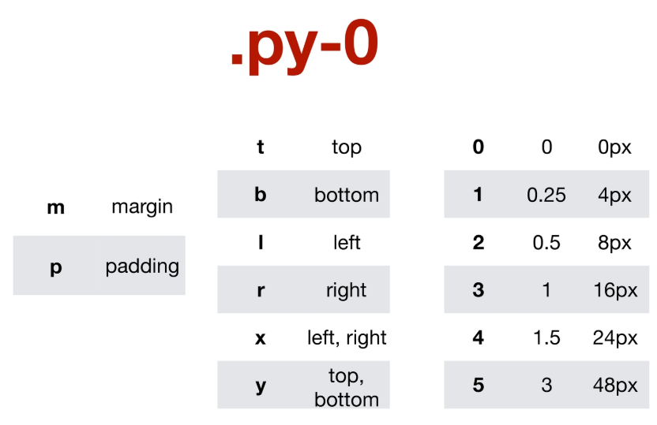
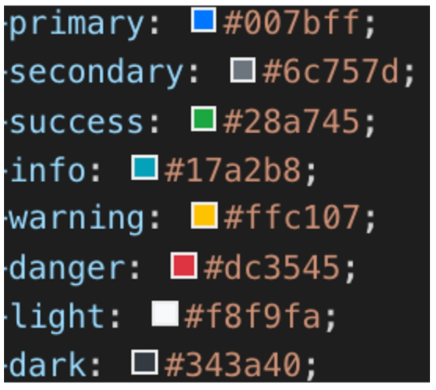
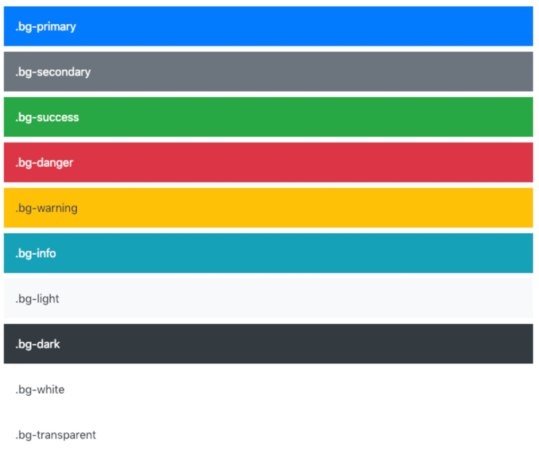
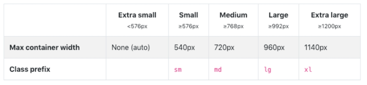
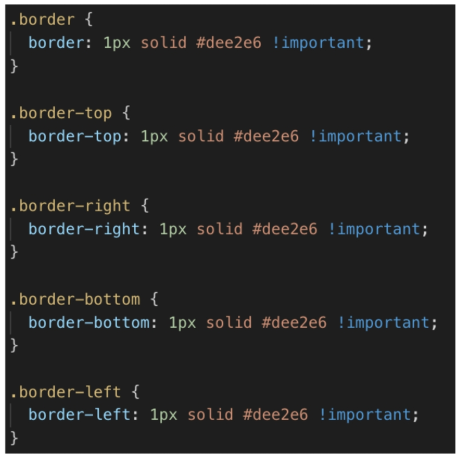
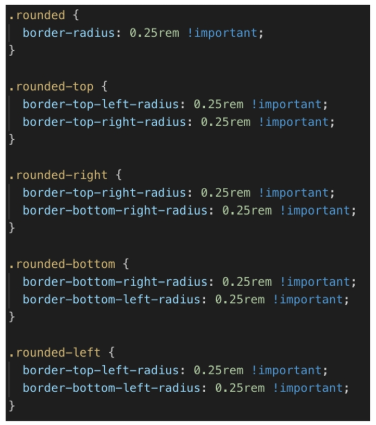

# Bootstrap 

> `부트스트랩`
>
> 모바일 대응이 가능한 웹사이트를 만들 수 있게 해주는
>
> 세계에서 가장 유명한 `프론트엔드 컴포넌트 라이브러리` 이다.
>
> HTML / CSS / JS 가 함께 있는..
>
> 버전 v4.4.1 (4.4 버전 이용)
>
> 브라우저들마다 기본 스타일시트 값이 다르다. ( 크롬 body >  margin 8px )
>
> https://getbootstrap.com/


## CDN

> Content Delivery (Distribution) Network
>
> 컨텐츠(CSS, JS, Image, Text 등) 을 효율적으로 전달하기 위해 여러 노드에 가진 네트워크에 데이터를 제공하는 시스템

- 장점

> 개별 end-user의 가까운 서버를 통해 빠르게 전달 가능(지리적 이점)
>
> 외부 서버를 활용함으로써 본인 서버의 부하가 적어짐.
>
> CDN은 보통 적절한 수준의 캐시 설정으로 빠르게 로딩할 수 있음.


css

- `<head>` 에다가 작성

```
<link rel="stylesheet" href="https://stackpath.bootstrapcdn.com/bootstrap/4.4.1/css/bootstrap.min.css" integrity="sha384-Vkoo8x4CGsO3+Hhxv8T/Q5PaXtkKtu6ug5TOeNV6gBiFeWPGFN9MuhOf23Q9Ifjh" crossorigin="anonymous">
```


js

- `<body>` 끝나는 태그 바로 위에

```
<script src="https://code.jquery.com/jquery-3.4.1.slim.min.js" integrity="sha384-J6qa4849blE2+poT4WnyKhv5vZF5SrPo0iEjwBvKU7imGFAV0wwj1yYfoRSJoZ+n" crossorigin="anonymous"></script>
<script src="https://cdn.jsdelivr.net/npm/popper.js@1.16.0/dist/umd/popper.min.js" integrity="sha384-Q6E9RHvbIyZFJoft+2mJbHaEWldlvI9IOYy5n3zV9zzTtmI3UksdQRVvoxMfooAo" crossorigin="anonymous"></script>
<script src="https://stackpath.bootstrapcdn.com/bootstrap/4.4.1/js/bootstrap.min.js" integrity="sha384-wfSDF2E50Y2D1uUdj0O3uMBJnjuUD4Ih7YwaYd1iqfktj0Uod8GCExl3Og8ifwB6" crossorigin="anonymous"></script>
```


___


### 1.1 Spacing

- `m : margin`  //  `p : padding`

  - t : top
  - b : bottom
  - l : left
  - r : right
  - x : left right
  - y : top bottom

- 1rem 기준

- 음수도 가능하다.

  > .my-`n`0

- `.mx-auto`




클래스를 줌으로써 bootstrap 에 적용되어있는 css 을 활용할 수 있다.

편하게 꺼내서 쓸 수 있는.. Css 모음이다.


___


### 1.2 Color




- 클래스에다가 이름 명시하기 ( `!important` )




- 활용
  - Text - 문자
  - btn - 버튼
  - bg - 배경
  - **border - 테두리**
    - 보더를 정의해주고 색입히는 css 클래스 입혀야한다.
  - rounded : 모서리
    - `.rounded-circle`
    - `.rounded-pill`


___


### 1.3 Display

- `.d-block`

- `.d-line`

- `.d-none`

- `.d-flex`

- `.d-line-block`

- `.d-table`

- `.d-sm-none` >>> 반응형

  - 반응형 ( 모바일 ) 

  - ```css
    @media (min-width: 576px)
    .d-sm-none {
        display: none !important
    }
    ```

    - sm
    - md
    - lg
    - xl
    - 


___


### 1.4 Position

- `.position-static`
- `.position-relative`
- `.position-absolute`
- `.position-fixed`
  - `.fixed-top`
  - `.fixed-bottom`


___


### 1.5 Text

- `.text-center`
- `.font-weight-bold`


___


### 1.6 Border

- `.border`
  - 


- `.border .border-primary`
  - **테두리와 , 색상 조합도 가능하다.**


- `.rounded`

  - 

  