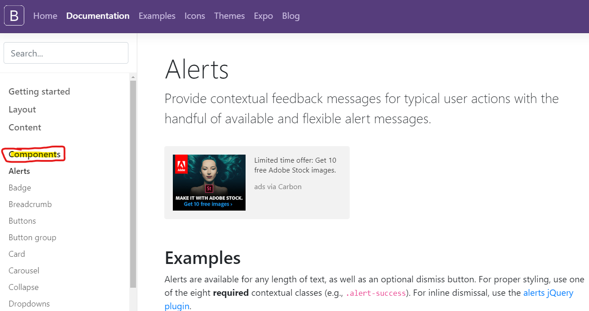
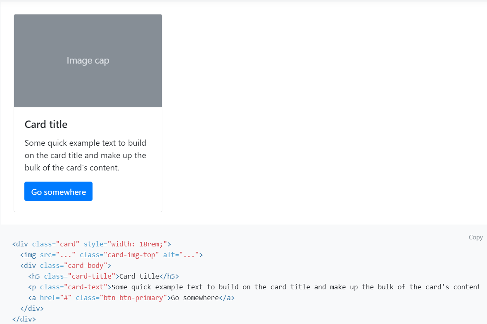
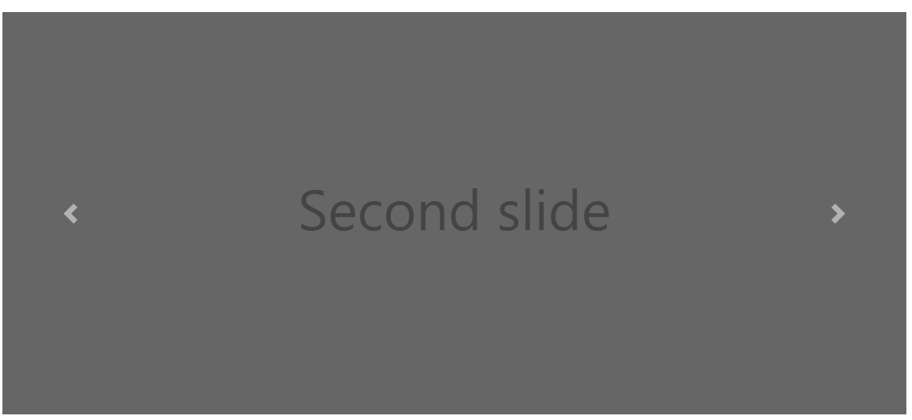
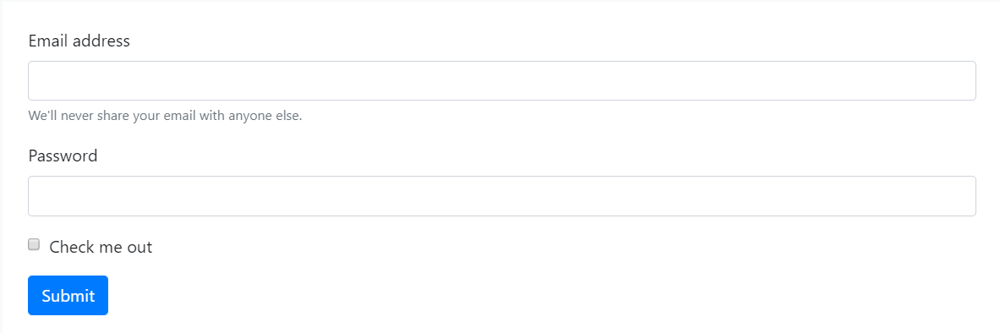
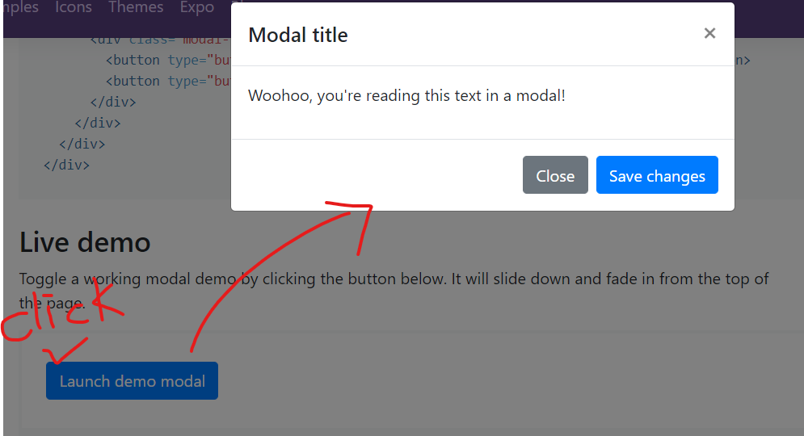
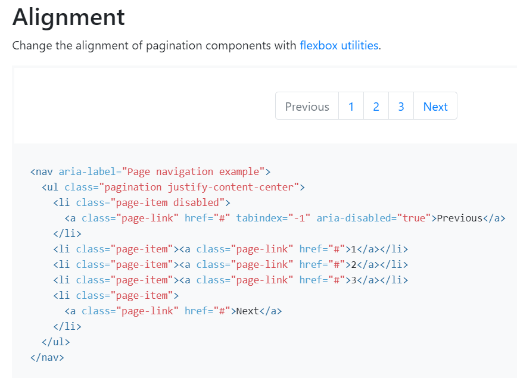

# Bootstrap 




## Components


### `.alert-success`

- 경고문

- `alert-primary` 와 같이 색상을 같이 입혀주고 `alert-link` 같이 쓰자

- ```html
  <div class="alert alert-primary" role="alert">
    A simple primary alert—check it out! <a href="#" class="alert-link">an example link</a>.
  </div>
  ```

  


### `.badge`

- 뱃지

- ```html
  <h1>Example heading <span class="badge badge-secondary">New</span></h1>
  ```

- 버튼안에 넣을 수도 있다. ( 쇼핑몰에서 New 등등 )


### `.breadcrumb`

- 사이트 이동 경로

- ```html
  <nav aria-label="breadcrumb">
    <ol class="breadcrumb">
      <li class="breadcrumb-item"><a href="#">Home</a></li>
      <li class="breadcrumb-item"><a href="#">Library</a></li>
      <li class="breadcrumb-item active" aria-current="page">Data</li>
    </ol>
  </nav>
  ```


### `.buttons`

- 버튼 생성 코드

- ```html
  <button type="button" class="btn btn-warning">Warning</button>
  ```


### `.card`




- Horizontal

  - ```html
    <div class="card mb-3" style="max-width: 540px;">
      <div class="row no-gutters">
        <div class="col-md-4">
          
        </div>
        <div class="col-md-8">
          <div class="card-body">
            <h5 class="card-title">Card title</h5>
            <p class="card-text">This is a wider card with supporting text below as a natural lead-in to additional content. This content is a little bit longer.</p>
            <p class="card-text"><small class="text-muted">Last updated 3 mins ago</small></p>
          </div>
        </div>
      </div>
    </div>
    ```


### `.Carousel`

- 회전목마처럼 옆으로 넘기는..?
- 슬라이드 옆으로 넘기는 형식
- 이미지 옆으로 넘기는..



```html
<div id="carouselExampleControls" class="carousel slide" data-ride="carousel">
  <div class="carousel-inner">
    <div class="carousel-item active">
      
    </div>
    <div class="carousel-item">
      
    </div>
    <div class="carousel-item">
      
    </div>
  </div>
  <a class="carousel-control-prev" href="#carouselExampleControls" role="button" data-slide="prev">
    <span class="carousel-control-prev-icon" aria-hidden="true"></span>
    <span class="sr-only">Previous</span>
  </a>
  <a class="carousel-control-next" href="#carouselExampleControls" role="button" data-slide="next">
    <span class="carousel-control-next-icon" aria-hidden="true"></span>
    <span class="sr-only">Next</span>
  </a>
</div>
```


- **id 를 수정하면 다같이 수정해줘야 js 가 동작하므로 주의한다.**
- `sr-only` : screen reader only
  - 시각장애분들을 위한 손으로 스크린읽는분들 Next 텍스트가 들리게 된다.
  - 웹 접근성을 위한 부분이다.


### `.Collapse`

- 누르면 밑에 부가 설명 나오는것


### `.dropdowns`

- 누르면 밑에 선택하는 부분 나오는 것


### `.forms`

- `django` 에서 가장 많이 다루게 될 컴포넌트



```html
<form>
  <div class="form-group">
    <label for="exampleInputEmail1">Email address</label>
    <input type="email" class="form-control" id="exampleInputEmail1" aria-describedby="emailHelp">
    <small id="emailHelp" class="form-text text-muted">We'll never share your email with anyone else.</small>
  </div>
  <div class="form-group">
    <label for="exampleInputPassword1">Password</label>
    <input type="password" class="form-control" id="exampleInputPassword1">
  </div>
  <div class="form-group form-check">
    <input type="checkbox" class="form-check-input" id="exampleCheck1">
    <label class="form-check-label" for="exampleCheck1">Check me out</label>
  </div>
  <button type="submit" class="btn btn-primary">Submit</button>
</form>
```

- `for` 속성과 `id` 속성은 일치해야 한다.


### `.modal`



- 어떠한 버튼을 눌렀을때 어떠한 창이 뜨게 하고 싶다.

```html
<!-- Button trigger modal -->
<button type="button" class="btn btn-primary" data-toggle="modal" data-target="#exampleModal">
  Launch demo modal
</button>

<!-- Modal -->
<div class="modal fade" id="exampleModal" tabindex="-1" role="dialog" aria-labelledby="exampleModalLabel" aria-hidden="true">
  <div class="modal-dialog" role="document">
    <div class="modal-content">
      <div class="modal-header">
        <h5 class="modal-title" id="exampleModalLabel">Modal title</h5>
        <button type="button" class="close" data-dismiss="modal" aria-label="Close">
          <span aria-hidden="true">&times;</span>
        </button>
      </div>
      <div class="modal-body">
        ...
      </div>
      <div class="modal-footer">
        <button type="button" class="btn btn-secondary" data-dismiss="modal">Close</button>
        <button type="button" class="btn btn-primary">Save changes</button>
      </div>
    </div>
  </div>
</div>
```


### `.navbar`

- 네비게이션 바


### `.pagination`



- 페이지 넘어 가는것..


___

- 스타트부트스트랩에서 이력서 템플릿 다운받아서 바탕화면에 압축 푼다.
- css // css minified
  - 코드 경량화
    - 해외에선 인터넷이 느리기때문에 최대한 용량을 줄인 것..


### `fab` `fa`

___

> 부트스트랩처럼 클래스이름을 줌으로써 이미지를 사용할수 있게 만들어주는 라이브러리(?)

- `fontawesome`


## 기술블로그

- jekyll ( 지킬 )  - ruby

- gatsby ( 개츠비 )  - react

- hexo (헥소) - vue

> 마크다운을 html/css 가 적용되어있는 형식으로 바꾸어주는 친구들