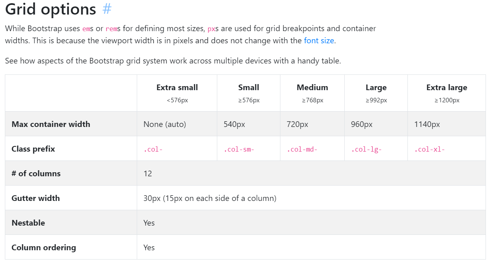

# Bootsrap => Grid System (css)

## 반응형 Web

> https://getbootstrap.com/docs/4.4/layout/grid/



#### 클래스명에다가 주는것

- Container
  - row
    - col

```html
<div class="container">
    <div class="row">
        <div class="col-12 col-sm-6">
            내용
        </div>
    </div>
</div>
```


**col-1,2,3,4,6,12**

각 행을 col 으로 나누는 것.. ( 12 를 나눈다 )


### Gutter

___

> items 들간의 padding 값


- `no-gutters`
  - 패딩을 없애서 아이템들끼리 붙게 된다.


### offset

___

