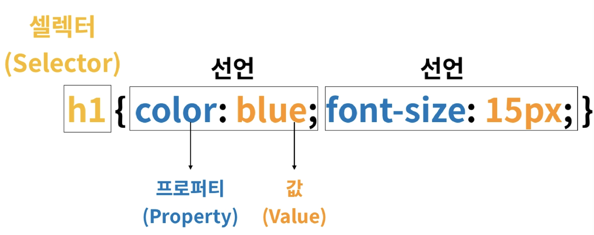
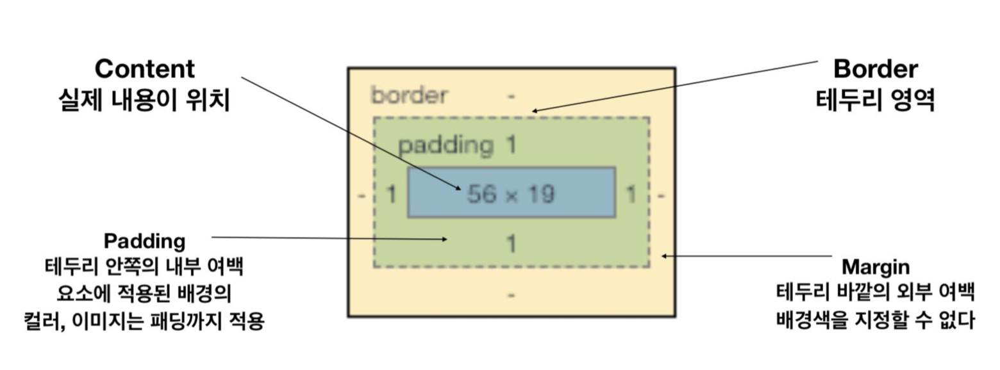
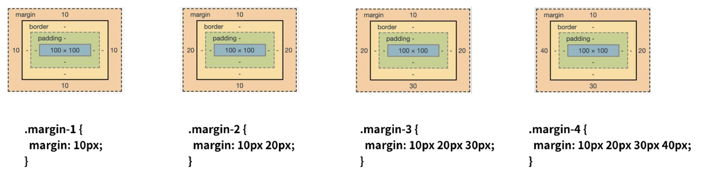

# CSS (Cascading Style Sheets)

HTML은 문서의 구조화 (Markup)

CSS는 스타일 정의


- CSS 의 기본 사용법




- CSS 정의 방법 (3가지)

  - 인라인 방법

    - ```html
      <h1 style="color:blue; font-size: 100px;"> This is my site </h1>
      ```

  - 내부참조

    - ```html
      <!DOCTYPE html>
      <html lang="ko">
        <head>
          <title>mySite</title>
          <style>
            h1 {
              color: blue;
              font-size: 100px;
            }
          </style>
        </head>
      </html>
      ```

  - **외부참조** ( 가장 많이 쓰인다. )

    - ```html
      <!DOCTYPE html>
      <html lang="ko">
        <head>
          <title>mySite</title>
      		<link rel="stylesheet" href="style.css">
        </head>
      </html>
      ```


- CSS 상속
  - CSS는 상속을 통해 부모 요소의 속성을 ~~모두~~ 자식에게 상속한다.
    - 속성(프로퍼티) 중에는 상속이 되는 것과 되지 않는 것들이 있다.
      - 상속 되는 것
        - Text 관련 요소 ( Font, color, text-align ), opacity, visibility 등
      - 상속 되지 않는 것
        - Box Model 관련 요소 (width, height, margin, padding, border, box-sizing, display)
        - position 관련 요소 (position, top/right/bottom/left, z-index) 등


- CSS 적용 우선순위 (cascading order)
  - 중요도 ( Importance ) - 사용시 주의
    - `!important`
  - 우선 순위
    - 인라인 / id선택자 / class 선택자 / 요소 선택자
  - 소스 순서


> 1 => green
>
> 2 => blueq
>
> 3 => skyblue ( css 파일에서 .skyblue 가 더 나중에 소스가 작성 되었기 때문에 )
>
> 4 => skyblue
>
> 5 => red
>
> 6 => violet ( !important 가 있어서 다 무시하고 이게 적용됨 )
>
> 7 => yellow ( 인라인 이어서 id선택자 보다 우선순위를 가진다 )
>
> 8 => violet ( 6번과 동일 )

금은동 비교해주셨던 내용.

소스 순서 < 우선 순위 < 중요도 


- Box Model 구성







