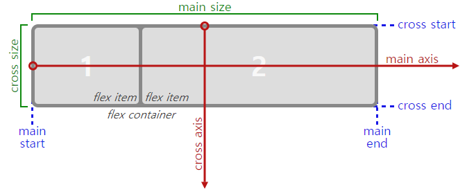
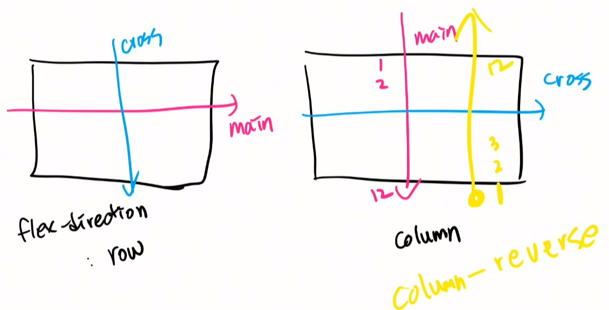
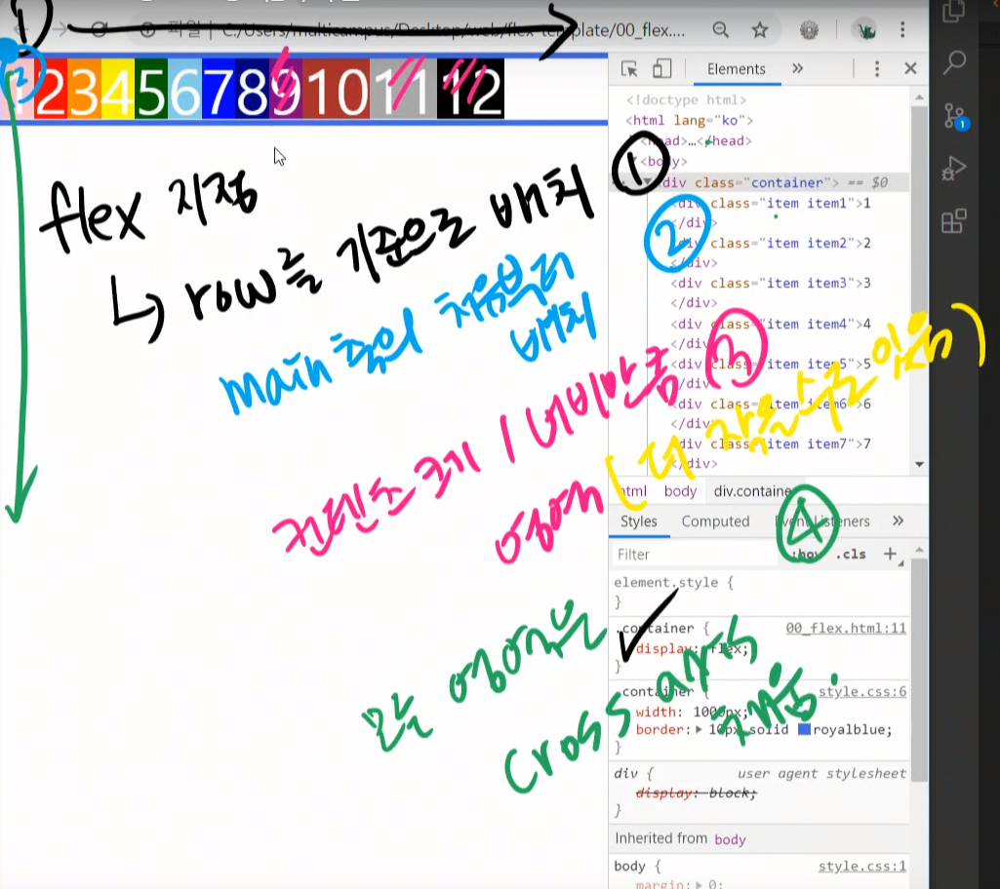
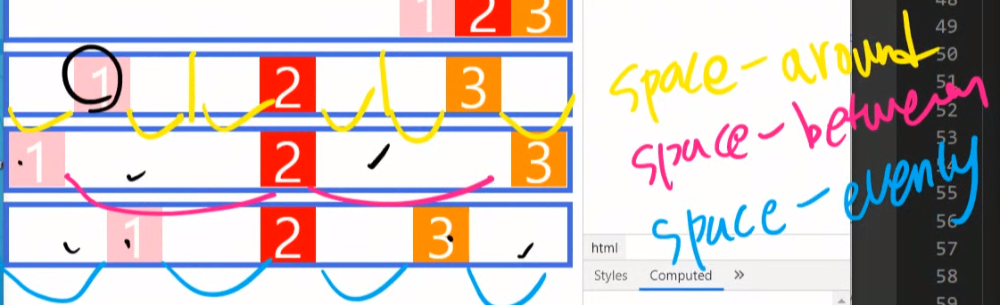
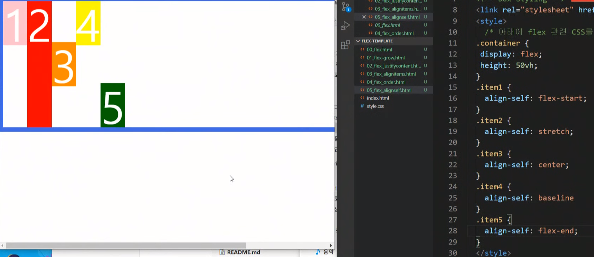

# CSS

## Flex

>1. Container
>2. items

- `flex` 이전에는 배치를 위해서 `float` , `position` 지정을 해야 했다.




## Flex 주요 개념

- Container
- item

```html
<style>
    .container {
        display: flex;
    }
</style>

<div class="container">
    <div class="item"></div>
    <div class="item"></div>
</div>
```


- `Main axis` ( 기본값 ), // ` corss axis` 




- `flex` 정의 시
  - `main axis` 을 기준으로 배치가 시작된다. ( 기본은 row )
    - 만약, `row-reverse` 로 지정하게 된다면, 오른쪽 끝부터 배치가 시작됨.
  - 모든 `item` 은 기본적으로 행으로 배치된다. (`flex-direction: row` 값으로 기본 설정 됨.)
  - 모든 `item` 은 `cross axis` 축을 모두 채운다. (`align-items : stretch` 값으로 기본 설정)
  - 모든 `item` 은 본인의 너비 혹은 컨텐츠 영역만큼 너비를 가지게 된다.
    - 경우에 따라서, 본인이 지정받은 너비보다 작을 수 있다. (`flex-wrap: nowrap` 이 기본값이기 때문)
      - 전체 아이템 너비의 합이 컨테이너 너비보다 작을 때




## flex 속성

### 1. flex-grow

> `flex-grow` 는 남은 너비를 비율로 가져간다.
>
> 기본값 : `flex-grow: 0;` 


### 2.justify-content

> main 축을 기준으로 정렬한다.

- 기본값 : `flex-start`
- flex-start
- flex-end
- center
- space-around
- space-between
- space-evenly




### 3.align-items

> cross 축을 기준으로 정렬한다.

- 기본값 : `stretch`
- stretch
- flex-start
- flex-end
- center
- baseline


### 4.order

> 아이템의 순서를 정의할 수 있다.

- order 기본값 0
- 음수값도 가질 수 있음.


### 5.align-self 

> 아이템에 직접 align을 지정할 수 있음.




## flex 요약&정리

- `justify-content` : main 축

  - flex-start (기본값)
  - flex-end
  - center
  - space-between
  - space-around

- `align=items` : cross 축

  - stretch (기본값)
  - flex-start
  - flex-end
  - center
  - baseline

- `flex-direction` : main 축 정하기

  - row
  - row-reverse
  - column
  - column-reverse

- `order`

  - 기본값 0
  - 음수 / 양수 가능

- `align-self` : 개별 아이템 지정

  - flex-start
  - flex-end
  - center
  - stretch (기본값)

- `flex-wrap`

  - nowrap (기본값) : 모든 요소 한줄 정렬
  - wrap : 요소들 여러 줄에 걸쳐 정렬
  - wrap-reverse

- `flex-flow` >> `flex-direction + flex-wrap`

  - ```css
    flex-flow: row wrap
    ```

  - 두개 합친것

- `align-content` : 간격 조절

  - flex-start
  - flex-end
  - center
  - space-between
  - space-around
  - stretch
  - **한줄만 있는 경우 효과가 없다.**

  