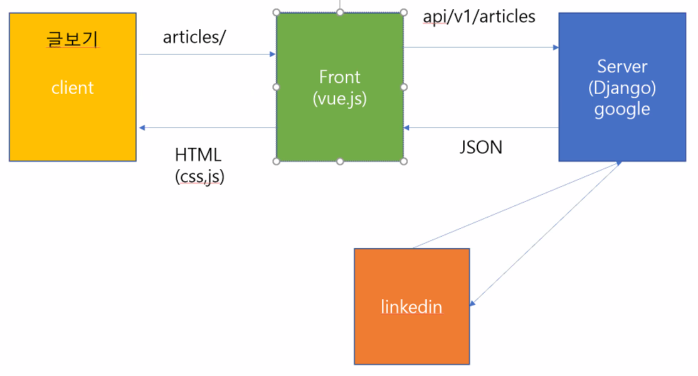

# DRF

> Template
>
> API
>
> Data - 빨리가져오기 & 데이터만
>
> Model
>
> ​	=> 분리 (javascript & frameworks)

why?

0. money

1. 서비스가 커지면 분리되어 있는 것이 편함

2. 페이지 정보가 바뀔때마다 html 파일을 통째로 갖고 오는 것보다 json 데이터 갖고 와서 그것만 반영하는 게 싸서..

3. UX 안좋으면 -> 유저x -> 돈x
4. churn (이탈율) -> 줄여야함

**Serialize (직렬화)**

- 포멧의 변환 (데이터를 전송/이동)

Object(언어, 데이터베이스)

-> String (Json)

**dict -> json (stringify)** : 직렬화

json -> dict (parse, deserialize)

`Bulk_create()`

:kissing_heart: ​**RESTful API**

> - URL 을 깔끔하게 정리하는 방식 (약속)
>
>   1. 동사 URL 에 집어 넣지마
>
>      - HTTP method (verb)
>
>      
>
>   2. 목적어만 URL에 집어넣어
>
>      - Resource (==data)
>
>   
>
> - 표현하는 방법이 너무 복잡함
>
>   C - (POST) `/articles/`
>
>   R - (GET)
>
>   	- index ( 모든 정보 ) `(GET) /articles`
>   	- detail ( 하나의 정보 ) `(GET) /articles/<id>`
>
>   U - (PUT)  `/articles/<id>`
>
>   D - (DELETE) `/articles/<id>`

- Django 에서는 GET, POST 만 가능
  - **Django REST Framework 를 통해서 POST, GET, PUT, DELETE 가능!!**

**페이지만 보여주는URL이 있고, Data만 보내주는 URL**

- API 관련 URL
  - subdomain
    - lab.ssafy.com
    - api.github.com ( 데이터만 쏘는 api 서버 )
  - 분리 URL /api/
    - ssafy.com/api/lectures/
    - github.com/api/repos/
  - versioning ( 하위호환 해야되므로 )
    - ssafy.com/api/v1/lectures/
    - `POST /api/v1/articles/1/like/`
    - `POST /api/v2/articles/1/comments/like/`

`/api/v1/articles/`

`/api/v1/articles/<id>`

