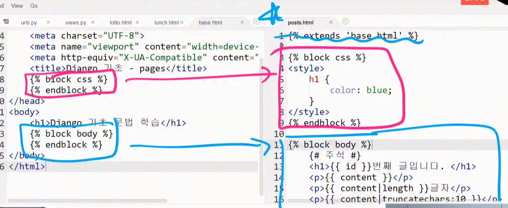
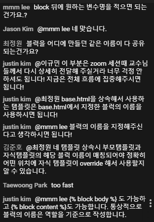
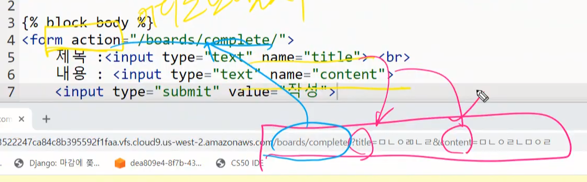
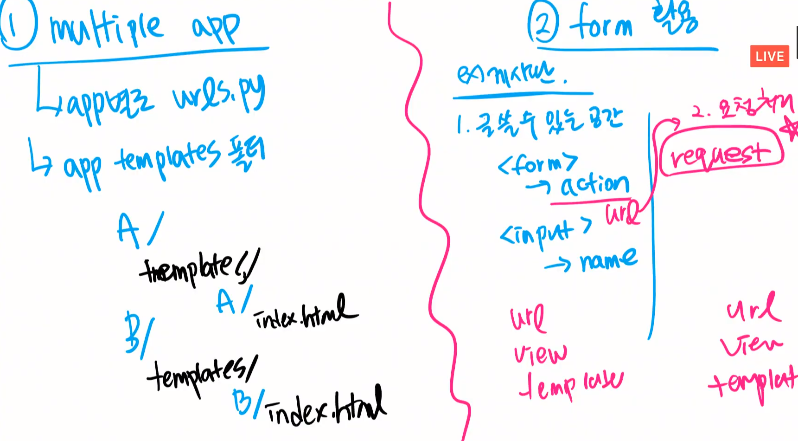
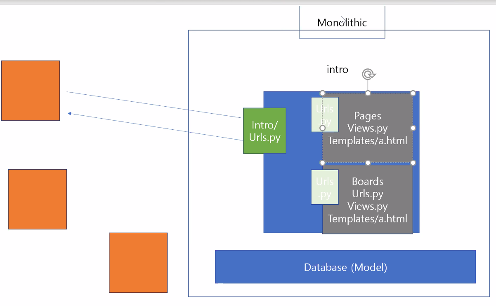
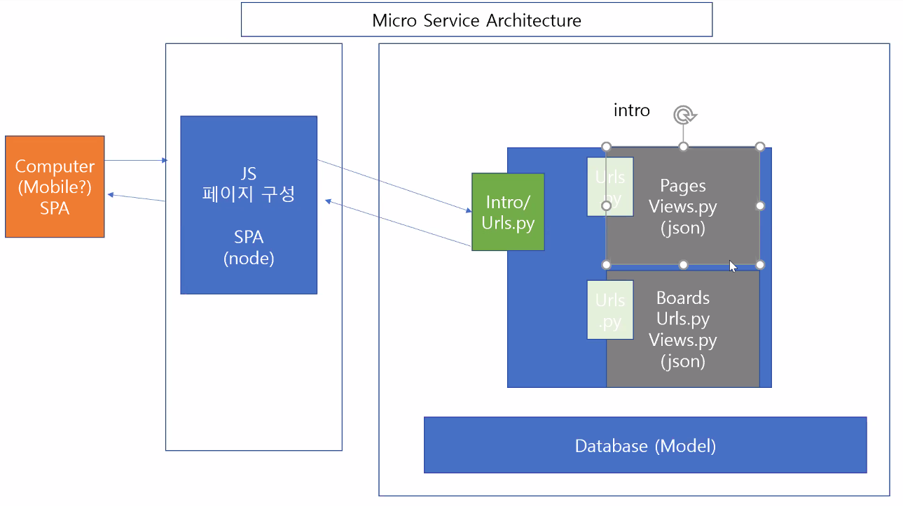
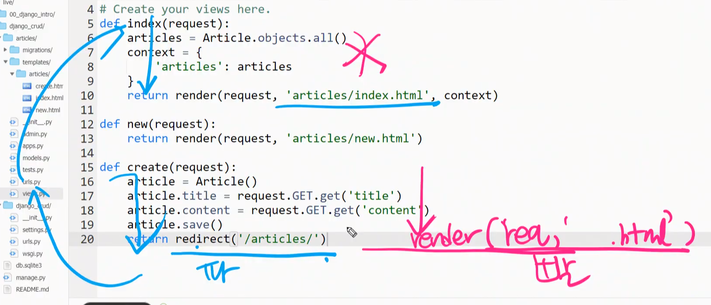
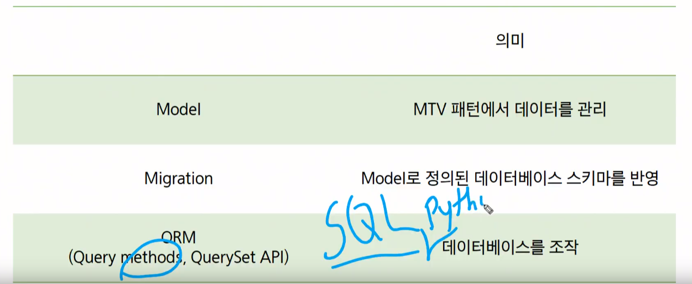

# DTL

## Django Template Language


1. 템플릿 확장






### Form 활용




## 멀티플 앱 ( 앱이 여러개 일때 )




# Django 로직






- 아마존이 내부적 서비스를 MSA 로 바꿈.. api 서비스로..


# render 와 redirect 의 차이점





# Django

## MTV

### Model




```python
article = Article()
article.full_clean() # 테이블 스키마에 맞게 데이터가 들어가 있는가? 확인/검증
```

