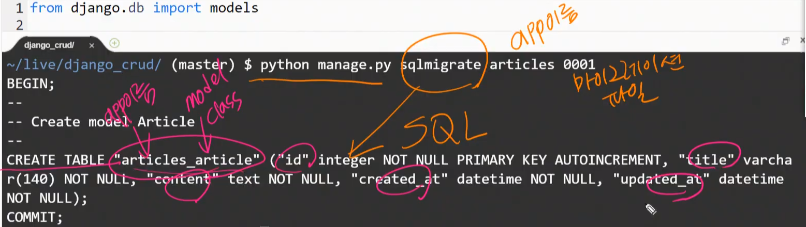

# Django(4)

## migration 흐름

1. Model 생성/수정/삭제 등

2. migration 파일 생성

   - migration 파일은 model의 변경사항을 기록하고, 데이터베이스 반영하기 위한 코드들로 구성된다.
   - migration 파일은 데이터베이스 스키마를 위한 버전관리시스템이라고 생각하자.

3. migrate 를 통한 데이터베이스에 적용

4. 데이터베이스를 초기화 하고 싶다면.

   - d.sqlite3 와 마이그레이션 파일을 같이 삭제한 후 다시 명령어를 입력.

5. `showmigrations` 현재 migrations 가 적용되어 있는지 확인

6. `python manage.py sqlmigrate articles 0001` 

   - 대응되는 실제 sql 문을 볼 수 있다.

   - [앱이름] [마이그레이션파일]
   - 

7. ```bash
   $ python manage.py sqlmigrate app_label migration_name # 필수 입력
   $ python manage.py sqlmigrate articles 0001
   
   $ python manage.py migrate [app_label] [migration_name] # [] 은 옵션
   $ python manage.py migrate
   ```

   - 대괄호는 옵션이다.


## ORM

> 객체관계매핑

1. `Article.objects.create(title=값, content=값)`

2. `a = Article(title=값, content=값)`

3. ```python
   a = Article()
   a.title = title
   a.content = content
   a.save()
   ```


## Variable routing

> {{ }}


## GET / POST

- `GET`

  - url 길이 제한이 있다. 
  - 정보를 가져오는 것

- `POST`

  - DB 값 저장

  - ```python
    {{ csrf_token }}
    ```

  - post 요청을 보낼때는 csrf 토큰을 같이 보낸다.


### csrf ( Cross-site request forgery )

> 사이트 간 요청 위조

랜덤 토큰값으로 체크..


