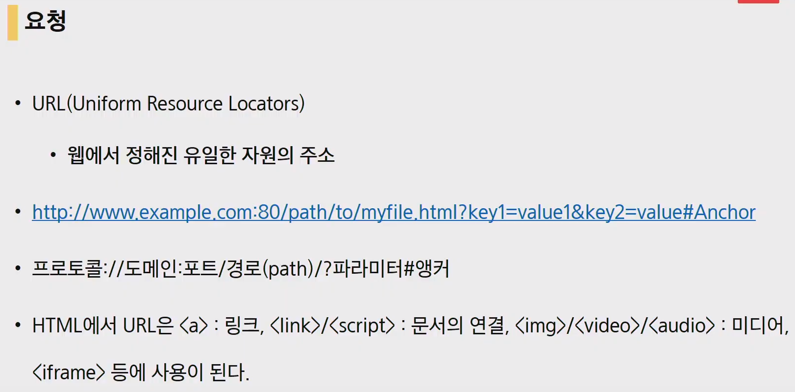
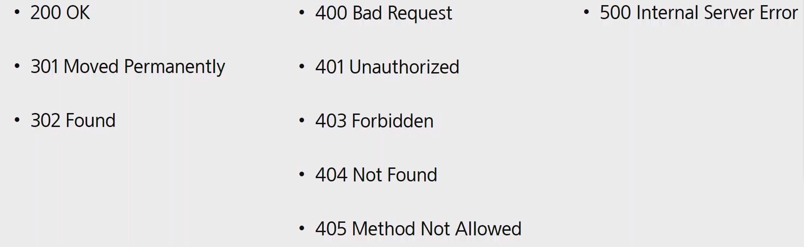
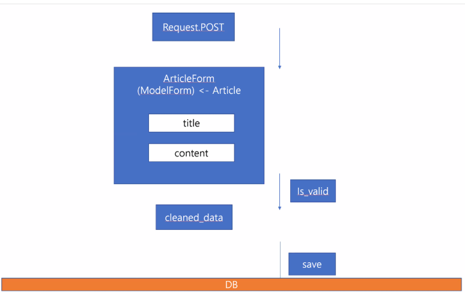

# Django(5)

## Django 기본 흐름

- url 을 정의한다.
- Views.py 에 실행할 함수를 만든다.
- 반환할 html 파일을 만든다. ( templates )

## 요청

## HTTP 메서드

- 주어진 리소스에 수행하길 원하는 행동으로 HTTP verb 라고 부르기도 한다.
- GET : 특정 리소스의 표시
  - `<a>` 태그 `<form>` 및 브라우저에서 주소창을 보내는 요청 등
  - URL을 활용(쿼리스트링)하여 데이터를 전송함, 따라서, 크기 제안 및 보안 이슈가 있음
- POST : 특정 리소스에 제출 (서버의 상태 변화)
  - 보통 HTML Form을 통해 서버에 전송하며, 서버의 변경사항을 만듦.
  - HTTP 요청메시지의 body에 데이터를 전송함

- 요청

`GET / HTTP/1.1`

- 응답
  - `HTTP/1.1 200 OK`
  - 상태 코드 확인할것.

`401` 로그인 X

`403` 로그인 O , 권한이 없을 때 금지됨

`404` 해당 URL 처리 불가

`405` GET 으로 처리해야되는데 POST 로 보냈을 때.

## Views.py 

### def Create():

