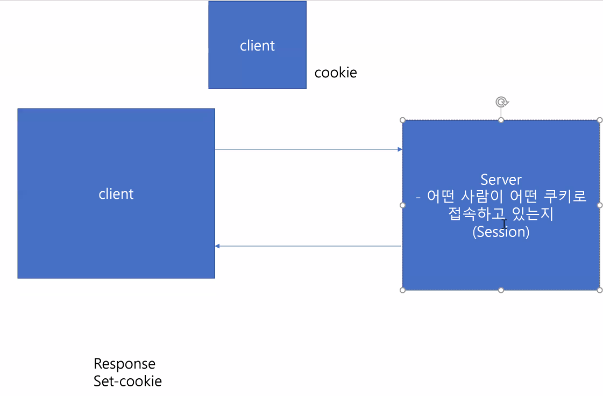
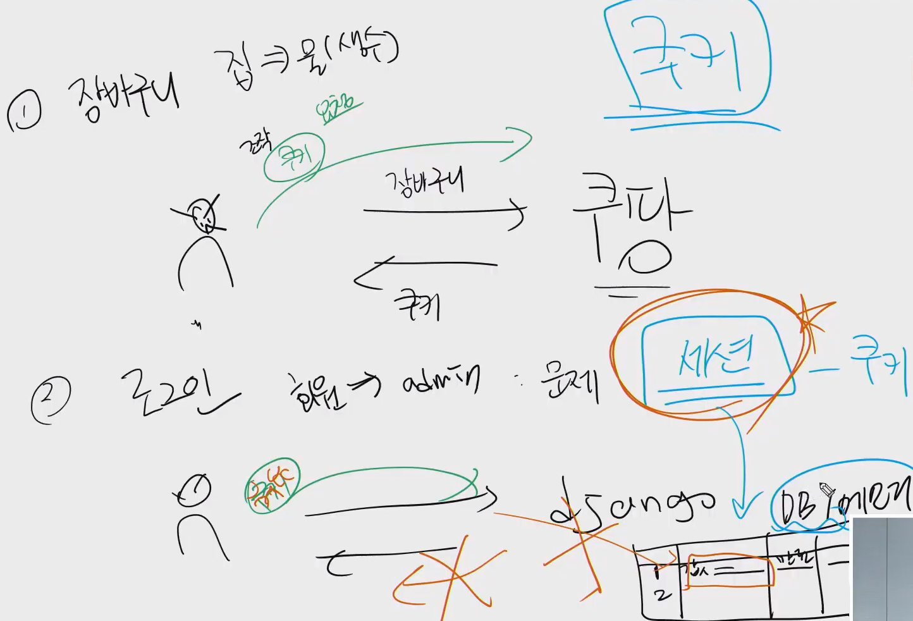
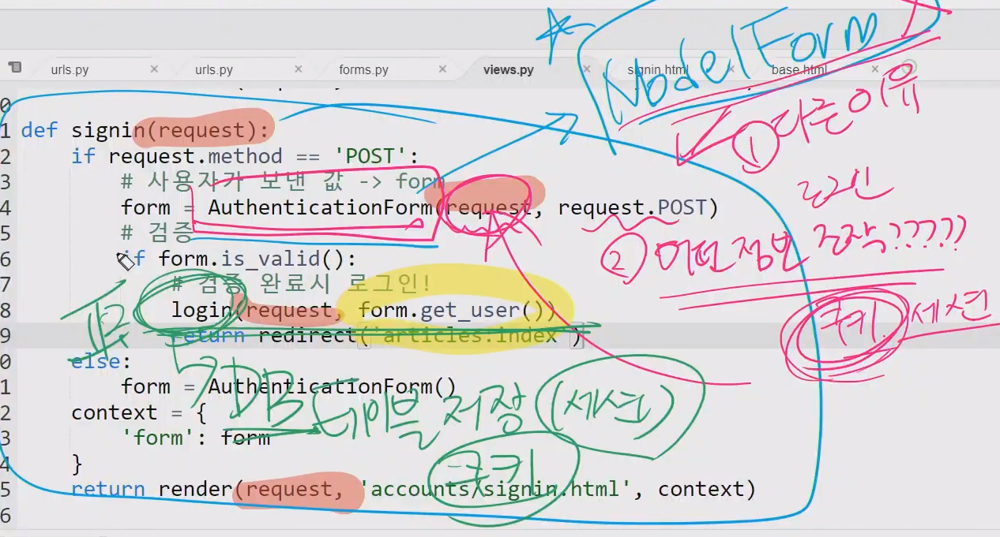
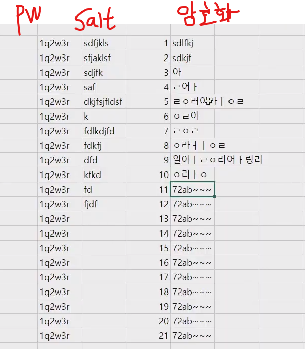
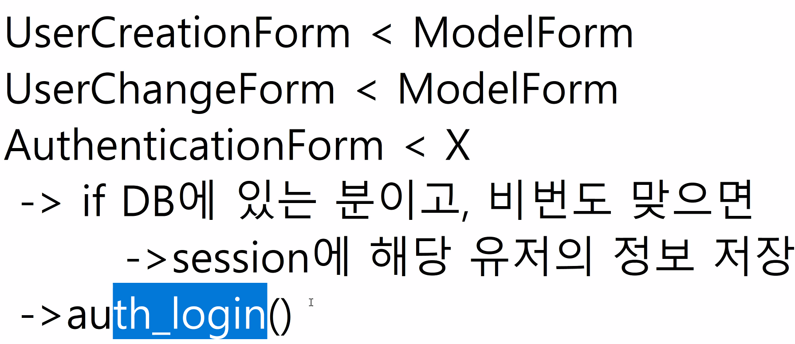

# HTTP

## Stateless, Connectionless

### 1.Stateless (무상태성)

### 2.Connectionless(무연결성)


render 하면 상태를 넘길 수 있지만.

redirect 는 정보를 넘길수없다.


### 쿠키/세션

- GDPR (유럽연합 일반 데이터 보호규칙) - 쿠키 마음대로 수집하는지 안하는지....










## Message

- 이전의 상태를 다음 Requst , Response 
- Message 프레임워크를 통해서 http 프로토콜자체의 무상태,무연결성의 단점을 보완해줌


# 사용자인증 (auth)

## 비밀번호

> 1q2w3e ==> 해시함수 ==> 1~~~~~asdfasd~~~~~
>
> 해시함수()
>
> 1. SHA256 ( 단방향 알고리즘 ) 역함수가 없어서 해석할수없음 - Secure Hash Algorithm

- [해쉬 SHA256](https://www.convertstring.com/ko/Hash/SHA256)

```python
>>> import hashlib
>>> pw = '1q2w3e4r'
>>> h = hashlib.sha256(pw.encode())
>>> h
<sha256 HASH object @ 0x7f3012cb3360>
>>> h.hexdigest()
'72ab994fa2eb426c051ef59cad617750bfe06d7cf6311285ff79c19c32afd236'
```




[네이버 : PBKDF2](https://d2.naver.com/helloworld/318732)


___

`Article.objects.all()` 

- 매우 헤비한 쿼리문
- 데이터를 다 들고와라
- DB 를 건드리는것
  - Disk Drive
  - CPU register(저장) -> RAM(달) -> 해왕성

- `lazy` : 활용될때 실행시키는게 좋음 ( 메모리 덜먹을수있어서 )


## 회원가입 ( 신규 User -> DB )

### UserCreationForm (C)

### UserChangeForm(U)


## 로그인 ( 기존 User -> DB 에 있는지 검증 )

### Authentication


## Django User

- 상속관계

`User < AbstractUser < AbstractBaseUser < models.Model`


- Custom 하기
  - Abstract 클래스를 상속받아 `myUser` 를 생성하기.


- 커스텀하는 경우
  - `get_user_model()` 이라는 함수를 사용함
    - `from django.contrib.auth import get_user_model()`
  - 기존, 커스텀한것 사용할 지


## UserForm



