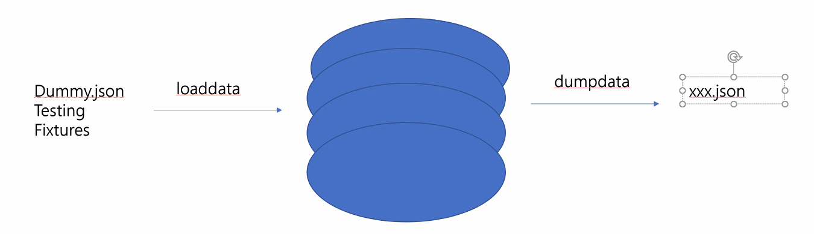

- 앱안에 `fixture 폴더` 만들기
  - 더미데이터( dummy.json )를 `fixture` 안에 넣기

```shell
$ python manage.py loaddata [dummy.json]
```


- DB에 있는 데이터 덤프하기 ( 빼오기 )

```shell
$ python manage.py dumpdata [musics,artist]

# python manage.py dumpdata [앱이름.모델명]
```


```shell
$ python manage.py dumpdata musics --indent 2 > dump2.json

# DB에 있는 데이터(dumpdata)를 dump2.json 파일로 빼오기 --indent 2 옵션줘서 보기 편하게
```




