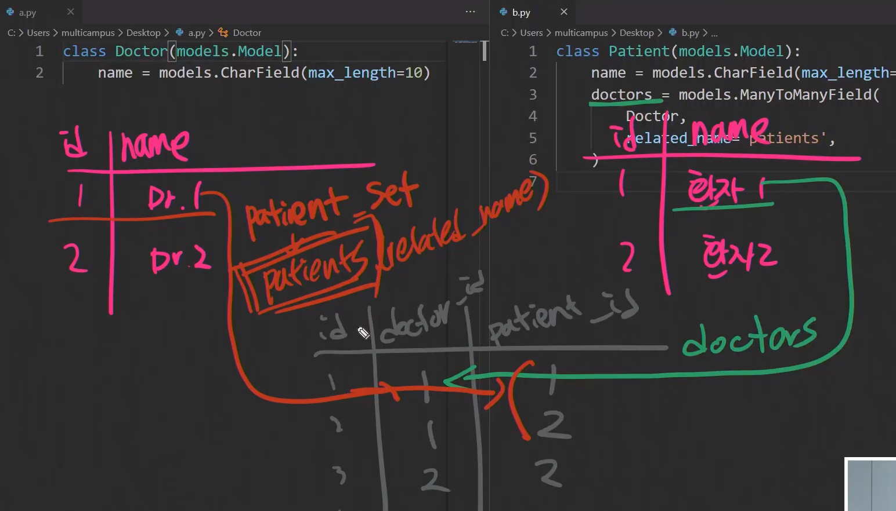

# M:N

## 1. 관계설정

```python
# models.py

class Doctor(models.Model):
    name = models.CharField(max_length=10)
    
class Patient(models.Model):
    name = models.CharField(max_length=10)
    doctors = models.ManyToManyField(Doctor, related_name='patients')
    
# 중계테이블이 필요한 경우
# 1. 예약 날짜와 같은 컬럼을 추가로 만들 필요가 있을때,
# 2. id만 저장할거면 중계테이블은 필요없음 (ManyToManyField 가 알아서 만들어 준다.)
#class Reservation(models.Model):
    #doctor = models.ForeignKey(Doctor, on_delete=Models.CASCADE)
    #patient = models.ForeignKey(Patient, on_delete=Models.CASCADE)
    #date = models.DateTimeField(auto_now_add=True)
    
```





- 동일한모델에서 같은 테이블(User) 을 외래키로 잡아버리면, `역참조 네임` 을 지정해줘야 할 경우가 발생한다.

```python
class Article(models.Model):
    title = 
    content = 
    created_at =
    updated_at = 
    user = models.ForeignKey(settings.AUTH_USER_MODEL, on_delete=models.CASCADE)
    # articles_article_like_user 테이블 생성
    # 목적어가 되는쪽에 작성해준다. ex) 유저는 [게시글] 을 좋아함.
    like_users = models.ManyToManyField(settings.AUTH_USER_MODEL,
                                       related_name='like_article')
    
class Comment(models.Model):
    pass
```


## 2. 좋아요 기능

> url -> variable routing
> view -> 좋아요 눌렀으면 취소, 안눌렀으면 좋아요.
> Template -> redirect

```python
# urls.py
path('<int:pk>/like/', views.like, name='like')

# views.py
def like(request, pk):
    article = get_object_or_404(Article, pk=pk)
    # 좋아요를 누른적이 있다면, => DB에 저장되어 있으면
    if request.user in article.like_users.all():
    # if article.like_users.filter(id=request.user.pk).exists():
        # 좋아요 취소
        article.like_users.remove(request.user)
    else:
        # 좋아요
        article.like_users.add(request.user)
    return redirect('articles:detail', article.pk)
```