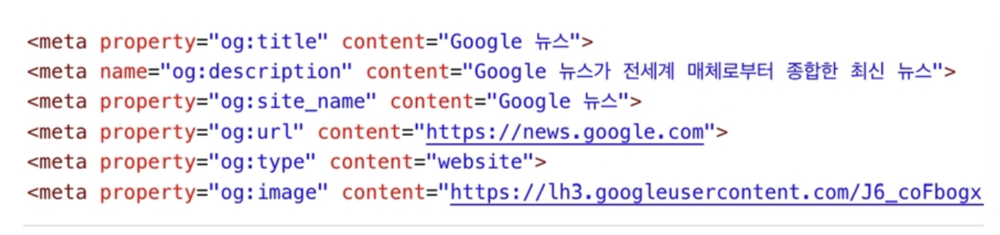
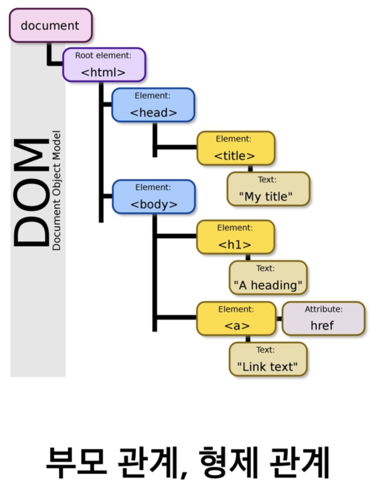

## 개발환경 설정

- Text - editor
  - Visual Studio Code (마이크로소프트)
    - 오픈소스, 무료
  - atom, sublime text, vi 등 다양한 텍스트 에디터 존재
  - HTML/CSS 코드 작성을 위한 VS코드 확장팩 추천
    - HTML Snippets, HTML CSS Support
    - Open in broswer
    - Auto rename tag, Auto close tag


- HTML 기본 구조

```html
<!DOCTYPE html>
<html lang="ko">
  <head>
    <!-- 문자 인코딩 정보 -->
    <meta charset="UTF-8"> 
    <title>Document</title>
  </head>
  <body>
    
  </body>
</html>
```


- **<head>**
  - 문서 제목, 문자 인코딩 등의 문서 정보를 담고 있음
  - 메타데이터를 통해 웹 문서에 대한 추가 정보를 선언
    - 메타데이터를 표현하는 새로운 규약 
      - `Open Graph Protocol`
        - 페이스북에서 만들었음
        -  
  - 외부 파일 연결
    - CSS 파일 혹은 Javascript 파일


- `시멘틱태그`
  - HTML5 에서 의미론적 요소를 담은 태그의 등장. ~~의미없는 div 쓰는 대신 시멘틱태그 쓰자~~
  - 대표적인 시멘틱 태그
    - Header : 문서 전체나 섹션의 헤더 (머릿말 부분)
    - nav : 네비게이션
    - aside : 사이드에 위치한 공간, 메인 콘텐츠와 관련성이 적은 콘텐츠
    - Section : 문서의 일반적인 구분, 컨텐츠의 그룹을 표현
    - article : 문서, 페이지, 사이트 안에서 독립적으로 구분되는 영역
    - footer : 문서 전체나 섹션의 푸터 (마지막 부분)


- Dom ( Document Object Model ) 트리
  - 
- 요소 (element)
  - `<h1> contents </h1>`
    - 여는 태그와 닫는 태그를 항시 명시할 것 ( 닫는 태그가 필요없는 요소도 있음 )


- 속성 (Attribute)
  - `<a href="https://google.com"> Google </a>`
    - 태그(요소:element) 별로 사용할 수 있는 속성은 다르다.
- 

